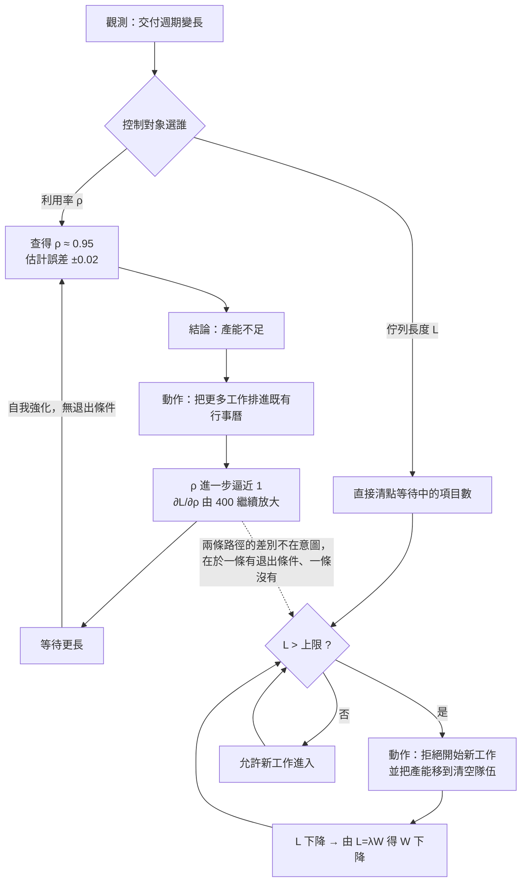

+++
title = "相關而不可控：利用率的敏感度為何在滿載前發散，以及控制對象必須換成什麼"
date = "2026-09-14T10:30:03+08:00"
author = "梅乾"
draft = false
isCJKLanguage = true
description = "透過 Kingman VUT 公式與佇列敏感度發散推導，解析高變異環境下產能利用率無法作為控制槓桿的數學機理，論證將控制訊號替換為在製品佇列長度並主動拒絕新工作的必要性。"
tags = [
    "分析論述", # term:AnalyticalEssay
    "流動治理", # term:FlowGovernance
    "排隊論", # term:QueueingTheory
    "控制訊號", # term:ControlSignal
    "在製品", # term:WorkInProgress
    "敏感度分析", # term:SensitivityAnalysis
    "佇列長度", # term:QueueLength
  ]
series = ["進不了控制迴路的量：研發治理中的可重複性前提、流動守恆與文字效力"]
[ai_info]
    [ai_info.generation]
        model = "Claude Opus 5"
        agent = "Claude Code VSCode Extension 2.1.270"
    [ai_info.refinement]
        model = "Gemini 3.8 Flash"
        agent = "Antigravity IDE 2.5.5"
+++

<!--more-->

## 導言

一個團隊的交付週期開始變長。負責排程的人查了資料，發現最近三個月每個人的可用時間排滿程度都在九成五以上，於是得到一個看起來無懈可擊的結論：產能不足。

處理方式隨之確定——把手上還沒排進去的工作壓縮進既有的行事曆，並要求各項目再壓縮預估。三週後交付週期又長了一截。同一個推論鏈再跑一次：還是產能不足，再壓縮一次。

這條迴路在許多組織裡穩定運轉多年，而它的每一步都是理性的。從結果回推，值得注意的不是「他們判斷錯了」，而是**他們使用的那個量與他們想控制的那個量之間，關係是對的，方向也是對的，唯獨不能反過來用。**

利用率與等待時間之間有一條真實且強烈的關係。問題在於這條關係被當成了一條控制律：既然利用率高會讓等待變長，那麼把利用率管好就能把等待管好。這個推論在形式上是把一個預測關係反轉成一個控制關係，而反轉的合法性需要額外條件——條件不成立時，反轉得到的是一條會自我強化的迴路。

本文要做的是把那條關係的定量形狀寫出來，指出它在哪個區間失去可控性，並給出替代的控制對象。核心的**量化**（Quantization） <!-- term:Quantization -->結果只有一個：**在接近滿載時，等待對利用率的敏感度以 $(1-\rho)^{-2}$ 發散，因此利用率的估計誤差被放大到使它無法作為**控制訊號**（Control Signal） <!-- term:ControlSignal -->。**

> [!IMPORTANT]
> **量化** <!-- term:Quantization --> (Quantization): 以較少位元表示權重或啟動值，改變數值格點以降低記憶體與計算成本的近似方法。 <!-- anchor:Quantization -->
> **控制訊號** <!-- term:ControlSignal --> (Control Signal): 控制系統中用以調整執行機構狀態的即時回饋輸入；必須具備可及時反應偏差且敏感度不致發散之特性。 <!-- anchor:ControlSignal -->


---

## 分析

### 關係的形狀：變異、利用率與時間的乘積

先把那條關係寫清楚，因為它的形狀決定了後面所有結論。

設一個處理工作的單位為**工站**（station），工作以速率 $\lambda$ 抵達，工站以速率 $\mu$ 處理，定義**利用率**（utilization）$\rho=\lambda/\mu$。等待時間 $W_q$ 與 $\rho$ 的關係不是線性的，而是有一個明確的分解形式。

對於一般到達與一般服務時間分佈的單工站系統，等待時間有一個廣泛使用的近似，其重尾流量下的漸近結果建立於 [Kingman，1961 / 《The single server queue in heavy traffic》](https://doi.org/10.1017/S0305004100036094)：

$$
W_q \;\approx\; \underbrace{\left(\frac{c_a^2 + c_s^2}{2}\right)}_{\text{變異項 V}} \cdot \underbrace{\left(\frac{\rho}{1-\rho}\right)}_{\text{利用率項 U}} \cdot \underbrace{\mathbb{E}[S]}_{\text{時間項 T}}
$$

其中 $c_a^2$ 與 $c_s^2$ 分別是到達間隔與服務時間的平方變異係數，$\mathbb{E}[S]$ 是平均服務時間。這個分解把三個獨立的因素分開：**變異有多大、系統有多滿、單件要多久。**

三項相乘這個形式本身就回答了一個常見的困惑。當一個系統的變異接近零時，$V\to \tfrac{0+0}{2}=0$，整個等待時間歸零，此時把 $\rho$ 推到 0.99 也不會有隊伍。裝配線之所以能把利用率拉滿而不出事，原因在這裡——不是因為裝配線的管理者更厲害，是因為他們的 $V$ 接近零。

而**佇列長度**（Queue Length） <!-- term:QueueLength -->與等待時間之間有一條不依賴任何分佈假設的恆等關係，出自 [Little，1961 / 《A Proof for the Queuing Formula: $L=\lambda W$》](https://doi.org/10.1287/opre.9.3.383)：

> [!IMPORTANT]
> **佇列長度** <!-- term:QueueLength --> (Queue Length): 在處理工站前等待服務的工作項目數量。 <!-- anchor:QueueLength -->


$$
L \;=\; \lambda W
$$

這條關係的價值在於它把兩個量綁在一起。控制其中一個等於控制另一個，因此後面關於「該控制什麼」的討論可以在 $L$ 與 $W$ 之間自由切換。

**因果機制**：等待來自到達與服務的時間不匹配。系統愈滿，吸收不匹配的空檔愈少，而 $\rho/(1-\rho)$ 正是這個「空檔耗盡」過程的解析形式。

**邊界條件**：Kingman 的形式是重流量下的近似，在 $\rho$ 很小時會高估等待。實務上它在 $\rho>0.5$ 的區間夠準，而那正是需要它的區間。

**反例**：一個把「**產能利用率**（Capacity Utilization） <!-- term:CapacityUtilization -->」與「等待時間」畫在同一張圖上、並用線性迴歸配一條直線的分析報告。直線在 $\rho<0.7$ 的資料點附近看起來很貼合，而它對 $\rho=0.95$ 的外推預測會比實際值低一個量級——因為被配的那個函數在真實形狀裡有一個極點。

> [!IMPORTANT]
> **產能利用率** <!-- term:CapacityUtilization --> (Capacity Utilization): 工站實際負荷相對於可用處理能力的比例。 <!-- anchor:CapacityUtilization -->


### 敏感度發散：為什麼它是預測因子而不是控制槓桿

前一節給出了關係。這一節處理反轉的合法性，而這是本文的核心論證。

一個量要能作為控制訊號 <!-- term:ControlSignal -->，它必須滿足兩個條件：我們能足夠準確地估計它，而且我們能足夠準確地設定它。利用率兩個條件都不滿足，而且失敗的方式是可以被算出來的。

先看放大倍率。由 $L=\rho/(1-\rho)$ 對 $\rho$ 微分：

$$
\frac{\partial L}{\partial \rho} \;=\; \frac{1}{(1-\rho)^2}
$$

在 $\rho=0.5$ 時這個值是 $4$；在 $\rho=0.95$ 時是 $400$。也就是說，**同樣大小的利用率估計誤差，在高負載區造成的佇列預測誤差要大一百倍。**

而利用率的估計誤差在研發情境下並不小。$\rho=\lambda/\mu$ 的分子是需求到達率，分母是實際處理能力，兩者都必須被估計，而兩者的估計都依賴對未來工作量的判斷。一個 $\pm 0.02$ 的誤差是樂觀的假設，而它在高負載區映射出的佇列區間寬得驚人。

下面這段程式用離散事件模擬驗證 Kingman 近似，並量出四個利用率點上 $\pm 0.02$ 誤差所對應的佇列區間。模擬採 M/G/1 結構，服務時間由伽瑪分佈產生以便調整平方變異係數，只用 Python 標準函式庫。

```python
"""單站排隊：Kingman 近似的經驗驗證，與 dL/drho 在高利用率下的發散。"""
import heapq, math, random

def simulate(rho, n=400_000, cs2=1.0, seed=7):
    """M/G/1 離散事件模擬。服務時間均值固定為 1，平方變異係數 cs2 由伽瑪形狀參數控制。
    回傳平均等待時間 Wq 與平均佇列長度 Lq。"""
    rnd = random.Random(seed)
    lam = rho                                   # E[S] = 1，故 rho = lam
    shape = 1.0 / cs2 if cs2 > 0 else None
    def service():
        if shape is None:
            return 1.0
        return rnd.gammavariate(shape, 1.0 / shape)   # 均值 1，SCV = 1/shape
    t = free = 0.0
    wait_sum = area = 0.0
    events = []                                  # (完成時刻) 小根堆，用於計算在站數
    prev_t = 0.0
    inflight = 0
    for _ in range(n):
        t += rnd.expovariate(lam)
        while events and events[0] <= t:
            area += inflight * (events[0] - prev_t); prev_t = events[0]
            heapq.heappop(events); inflight -= 1
        area += inflight * (t - prev_t); prev_t = t
        start = max(t, free)
        wait_sum += start - t
        free = start + service()
        heapq.heappush(events, free); inflight += 1
    horizon = prev_t if prev_t > 0 else 1.0
    return wait_sum / n, area / horizon

def kingman(rho, ca2=1.0, cs2=1.0, ES=1.0):
    """Kingman VUT 分解：Wq ≈ [(ca²+cs²)/2] · [rho/(1-rho)] · E[S]。"""
    return ((ca2 + cs2) / 2.0) * (rho / (1.0 - rho)) * ES

print(f"{'rho':>6} {'Wq 模擬':>10} {'Wq 理論':>10} {'相對誤差':>9} "
      f"{'dL/drho=1/(1-rho)^2':>21} {'rho±0.02 造成的 L 區間':>26}")
rows = []
for rho in (0.50, 0.80, 0.90, 0.95):
    wq, _ = simulate(rho)
    th = kingman(rho)
    sens = 1.0 / (1.0 - rho) ** 2
    lo = (rho - 0.02) / (1.0 - (rho - 0.02))
    hi = (rho + 0.02) / (1.0 - (rho + 0.02))
    rows.append((rho, wq, th, abs(wq - th) / th, sens, lo, hi))
    print(f"{rho:6.2f} {wq:10.3f} {th:10.3f} {abs(wq-th)/th:8.1%} "
          f"{sens:21.1f} {f'[{lo:.2f}, {hi:.2f}] 寬 {hi-lo:.2f}':>26}")

# 變異的貢獻：同一個利用率下，把服務時間的平方變異係數從 1 降到 0.25
wq_var, _ = simulate(0.90, cs2=1.0)
wq_low, _ = simulate(0.90, cs2=0.25)
print(f"\nrho=0.90 時 cs²=1.00 的 Wq = {wq_var:.3f}；cs²=0.25 的 Wq = {wq_low:.3f}"
      f"（降幅 {1 - wq_low / wq_var:.1%}，理論預測 {1 - kingman(0.9,1,0.25)/kingman(0.9,1,1):.1%}）")

for rho, wq, th, err, *_ in rows:
    assert err < 0.06, f"rho={rho} 的模擬與 Kingman 近似必須吻合，實得誤差 {err:.1%}"
assert math.isclose(rows[-1][4] / rows[0][4], 100.0, rel_tol=1e-9), \
    "利用率由 0.50 升到 0.95，敏感度必須放大恰好 100 倍"
assert (rows[-1][6] - rows[-1][5]) > 20 * (rows[0][6] - rows[0][5]), \
    "同樣 ±0.02 的估計誤差，在高利用率下必須造成遠寬的佇列區間"
assert wq_low < wq_var, "降低服務變異必須降低等待時間"
print("OK: 六項不變式全部通過")
```

實際執行的輸出如下：

```text
   rho      Wq 模擬      Wq 理論      相對誤差   dL/drho=1/(1-rho)^2          rho±0.02 造成的 L 區間
  0.50      0.994      1.000     0.6%                   4.0        [0.92, 1.08] 寬 0.16
  0.80      3.932      4.000     1.7%                  25.0        [3.55, 4.56] 寬 1.01
  0.90      8.883      9.000     1.3%                 100.0       [7.33, 11.50] 寬 4.17
  0.95     18.223     19.000     4.1%                 400.0     [13.29, 32.33] 寬 19.05

rho=0.90 時 cs²=1.00 的 Wq = 8.883；cs²=0.25 的 Wq = 5.526（降幅 37.8%，理論預測 37.5%）
OK: 六項不變式全部通過
```

前兩欄確認了關係本身：模擬與理論在四個工作點上的相對誤差都在百分之四點一以內，因此後面的推論不是建立在一個近似的假象上。

真正的結論在最後一欄。在 $\rho=0.50$ 時，一個 $\pm 0.02$ 的估計誤差對應的佇列區間寬度是 $0.16$ 件；在 $\rho=0.95$ 時同樣的誤差對應 $19.05$ 件，**寬了將近一百二十倍**。這個區間的寬度已經超過區間中心值本身，也就是說在這個工作點上，「佇列大概多長」這個問題的答案在估計誤差範圍內可以差出一個量級。

一個估計誤差被放大到訊號本身量級的量，不能作為控制訊號 <!-- term:ControlSignal -->。這不是精度不夠的問題，是這個量在這個工作區間上失去了可控性。**利用率是佇列行為的強預測因子，同時是一個極差的控制槓桿，而兩件事出自同一個 $(1-\rho)^{-2}$。**

最後一行給出第二個可用的結果：在同一個利用率下把服務變異的平方變異係數從 $1.00$ 降到 $0.25$，等待時間降低了百分之三十七點八，與理論預測的百分之三十七點五吻合。這說明 $V$ 這一項是一個獨立且有效的旋鈕，而它不受 $(1-\rho)^{-2}$ 的放大影響。

**因果機制**：$L$ 在 $\rho\to 1$ 處有一個極點，因此它的導數在同一處以二階發散。估計誤差經由這個導數線性傳播，於是誤差帶的寬度隨 $(1-\rho)^{-2}$ 增長。

**邊界條件**：若 $\rho$ 可以被精確設定而非估計——例如一條由排程器嚴格控制節拍的自動化管線——則放大倍率不構成問題，因為沒有誤差可供放大。這正是製造業的情況。

**反例**：一個以「把利用率維持在 85%」作為排程政策的團隊。政策本身是對的，而執行它需要知道當前利用率是多少。這個數字由每個人自行回報的工時估計彙總而來，誤差輕易超過 $\pm 0.05$，因此實際的工作點可能落在 0.80 到 0.90 之間任一處，對應的佇列相差超過一倍。政策的精確度遠高於量測的精確度，於是它在執行上等於沒有政策。

### 換一個控制對象：佇列長度，與它的可執行形式

既然利用率不可控，就必須換一個控制對象。而替代品必須滿足利用率所不滿足的那兩個條件：可準確估計、可準確設定。

**佇列長度** <!-- term:QueueLength -->——某一狀態中等待處理的工作項數量——兩個條件都滿足。它是一個整數，可以被直接數出來，不需要估計任何分佈參數；它可以被直接設定，因為決定是否讓一個新項目進入等待狀態這件事完全在組織的控制之內。

由 Little 的關係 $L=\lambda W$，控制 $L$ 等於控制 $W$。因此把控制對象從 $\rho$ 換成 $L$，不是換了一個目標，是換了一個通往同一個目標的可控路徑。

下圖把兩條控制路徑並排，並標出其中一條為何會自我強化。



左路徑的迴路沒有任何一條邊指向終止，因為它的每一次迭代都會讓下一次的判讀更確信「產能不足」。右路徑則在每一輪都有一個明確的比較與一個明確的退出分支。

$L$ 的控制有一個具體且不受歡迎的可執行形式：**拒絕開始新工作**。這是它與利用率最大的差別，也是它難以推行的原因——拒絕開始新工作在組織裡有一個具體的樣子，就是某些人看起來閒著。

而「有人閒著」在同質單位的直覺裡是最明顯的浪費，也是最容易被追問的事。這條處方因此要求的不只是理解，還要求承受一個看起來像失職的狀態。它與一個更古老、在另一個業態裡完全正確的價值觀直接衝突，而這個衝突無法靠把道理講得更清楚來解決。

下表用一次完整的走查呈現兩種控制對象在同一組輸入下的分岔。

| 邊界輸入案例 | 關鍵判定條件 | 狀態轉移 | 最終處置結果 |
| :--- | :--- | :--- | :--- |
| 交付變長，查得 $\rho\approx 0.95$ | 以 $\rho$ 為控制對象；誤差 $\pm 0.02$ 映射 $L\in[13.29,\,32.33]$ | 判為產能不足 → 再排入工作 → $\rho\to 1$ | 迴路自我強化，無退出條件 |
| 交付變長，清點等待項為 31 件 | 以 $L$ 為控制對象；上限設為 12 | $L>12$ → 停止接受新項 → 產能轉向清空隊伍 | $L$ 單調下降，由 $L=\lambda W$ 得 $W$ 同步下降 |
| 某項目提前完成，釋出一人份產能 | 是否有餘裕吸收 | 以 $\rho$ 為對象：立即補入新工作，$\rho$ 回到上限 | 下一次變異無處吸收，等待傳播 |
| 同上 | 同上 | 以 $L$ 為對象：$L$ 未達上限才接受新項 | 餘裕被保留為流動的必要成本 |
| 變異來源可被降低（如統一交付格式） | $V=(c_a^2+c_s^2)/2$ 可獨立下修 | $c_s^2:1.00\to 0.25$ | $W_q$ 下降 37.8%，且不受 $(1-\rho)^{-2}$ 放大影響 |
| 系統變異趨近零 | $V\to 0$ | $W_q\to 0$ 與 $\rho$ 幾乎無關 | 此時把 $\rho$ 拉滿是正確的 |

表的最後兩列指出一個容易被忽略的機會：$V$ 這個旋鈕與 $U$ 這個旋鈕是乘法關係且彼此獨立，因此在無法降低 $\rho$ 的組織裡，降低 $V$ 仍然是一條完全可用的路徑。

下表把幾種表面現象與其底層病灶並置，用意是讓誤診在診斷階段就被攔下。

| 表面讀數 / 現象 | 底層動力學病灶 | 舊代脆弱做法 | 新代嚴格工程防線 |
| :--- | :--- | :--- | :--- |
| 大家都很忙而交付愈來愈慢 | $\rho\to 1$ 使 $\rho/(1-\rho)$ 進入急升區 | 判為產能不足，排入更多工作 | 清點各等待狀態的項目數與停留時間，定位堆積段 |
| 利用率讀數在 0.80 與 0.95 之間跳動 | $\rho$ 由自估工時彙總，誤差輕易超過 $\pm 0.05$ | 以該讀數執行「維持 85%」政策 | 改以可清點的佇列長度 <!-- term:QueueLength -->為控制對象，不經任何參數估計 |
| 佇列預測與實際落差一個量級 | $\partial L/\partial\rho=(1-\rho)^{-2}$ 在 $\rho=0.95$ 達 $400$ | 調整預測模型、增加歷史樣本 | 承認該工作點不可控，改用**在製品**（Work In Progress） <!-- term:WorkInProgress -->上限直接設定 |
| 設了在製品 <!-- term:WorkInProgress -->上限而它從未擋下任何事 | 例外放行使上限的拒絕集為空 | 保留上限，強調大家要自律 | 讓例外必須留痕並計數；例外多於常規即視為上限已失效 |
| 無法降低利用率因而停止行動 | 只看見 $U$ 一個旋鈕，忽略乘積中的 $V$ | 等待人力補充 | 收窄工作項規模分佈與交付格式，直接下修變異項 |

> [!IMPORTANT]
> **在製品** <!-- term:WorkInProgress --> (Work In Progress): 已進入生產流程但尚未交付完成的所有工作項目總和（簡稱 WIP）；在研發流程中多以未合併程式碼或未驗證構思等無形資訊形式存在。 <!-- anchor:WorkInProgress -->


**因果機制**：$L$ 是一個可直接清點的整數狀態變數，其量測不經過任何參數估計；而准入決策完全在系統控制之內，因此設定誤差為零。兩個條件同時滿足使它成為合法的控制訊號 <!-- term:ControlSignal -->。

**邊界條件**：$L$ 的上限必須被設在一個能讓工作真正流動的位置。設得太低會使工站頻繁空轉，此時瓶頸從等待變成切換；設得太高則等同於沒有上限。上限的選擇本身是一個需要調的參數，而它的調整可以靠觀測 $L$ 與 $W$ 的實際回應完成，不需要估計 $\rho$。

**反例**：一個設了在製品 <!-- term:WorkInProgress -->上限、而在上限被觸及時選擇「例外放行」的團隊。例外的理由總是充分的——這件事很急、那件事已經答應了客戶、另一件事只要一下下。三個月後例外的數量超過常規，而上限這個機制在紀錄上仍然存在。一個可以被無條件例外繞過的上限，其拒絕集合是空的。

---

## 反思

本文的分析有一個容易被推過頭的方向：它可能被讀成「高利用率永遠是錯的」。這不成立，而且反例就在同一組公式裡。$W_q$ 是三項的乘積，當 $V$ 接近零時整個乘積接近零，此時 $\rho=0.99$ 也不會有隊伍。**高利用率的危險程度由變異決定，而不是一個獨立的常數。**

這推出一個實務上很有用的次序：在無法降低利用率的組織裡，降低變異是一條平行的路徑，而且它不受那個放大倍率的影響。輸出中的百分之三十七點八就是這條路徑的一次量測——在 $\rho$ 完全沒有動的情況下，等待時間下降了將近四成。統一交付格式、減少工作項的規模分佈寬度、把需要跨團隊協調的部分與不需要的部分分開，這些都是在動 $V$ 而不是在動 $\rho$。

第二個反思關於那條自我強化迴路的韌性。它之所以難以被打斷，不是因為參與者不理性，而是因為它的每一次迭代都提供了支持自己的證據。等待變長、大家很忙、產能顯然不足——這三個觀察全部為真，而由它們推出的動作會讓下一輪的三個觀察更強烈。**一條由真實觀察餵養的錯誤迴路，比一條由錯誤觀察餵養的迴路穩固得多。**

要打斷它需要一個外部的、不由該迴路產生的訊號，而佇列長度 <!-- term:QueueLength -->正好是這樣一個訊號：它不依賴任何關於產能是否足夠的判斷，只依賴清點。這是它相對於利用率的第二個優勢，而這個優勢在文獻裡通常不被強調——它不只是更可控，還更難被既有敘事同化。

第三件值得記下的事是關於「拒絕開始新工作」這個動作的組織位置。它不是一個排程技巧，是一個需要有人承擔的決定，而承擔它的人會在短期內看起來做錯了事。因此這條處方的落地程度不由理解程度決定，而由**組織願不願意讓某個角色在一段時間內看起來像在失職**決定。任何不處理這一點的推行方案，都會在第一次有人閒著的時候被撤回。

最後一個觀察是關於這套分析的適用範圍。所有推導都假設工站的處理能力在觀測期內大致固定。當某一類工作的處理能力在短時間內大幅改變時，$\rho$ 的定義本身就變得不穩定，而此時討論「該把 $\rho$ 控制在哪裡」是在一個會移動的座標系上做定位。那種情況需要不同的分析工具，本文的結論在那裡只提供方向，不提供數值。

---

## 實務對比

**其一：規劃會議上的產能配置**

錯誤的作法是把每個人的可用時間填滿，並把剩餘的空檔視為待分配的資源。在有變異的系統裡，這個動作直接把工作點推進 $(1-\rho)^{-2}$ 急劇上升的區間，而此時等待時間的預測區間已經寬到無法據以決策。

正確的作法是先設定在製品 <!-- term:WorkInProgress -->上限，再讓上限決定能排入多少工作，而不是反過來。判準是：當一個項目提前完成或延後時，系統有沒有空間吸收它。沒有，那麼每一次變異都會完整傳播到下游。

**其二：交付變長時的第一個動作**

錯誤的作法是查利用率並據以判斷產能是否足夠。這個量在高負載區的估計誤差被放大約四百倍，因此它給出的答案幾乎必然是「產能不足」，而這個答案與實際情況無關。

正確的作法是清點各等待狀態中的項目數與它們的停留時間，並找出堆積發生在哪一段。清點不需要估計任何參數，因此它的結論不會被放大倍率污染。判準是：這個結論如果錯了，會在幾天內被下一次清點推翻嗎。

**其三：無法降低利用率時的替代路徑**

錯誤的作法是在承認「短期內沒辦法讓大家不那麼忙」之後就停止行動，因為看起來唯一的旋鈕轉不動。

正確的作法是轉另一個旋鈕。等待時間是變異項、利用率項與時間項三者的乘積，而變異項與利用率項彼此獨立。把工作項的規模分佈收窄、把交付格式統一、把需要跨團隊協調的工作與不需要的分流，都會降低變異項，且效果不經過那個放大倍率。判準是：這個動作會不會讓「同一類工作的耗時差異」變小。會，它就在對的旋鈕上。

---

## 結論

利用率與等待時間之間存在一條真實且強烈的關係，而這條關係只能單向使用。

由此得到三個可遷移的判斷。第一，等待時間是變異項、利用率項與時間項的乘積，因此高利用率的危險程度由變異決定；當變異接近零時把利用率拉滿是正確的，而這正是這套直覺誕生的環境。第二，佇列對利用率的敏感度為 $(1-\rho)^{-2}$，在 $\rho=0.95$ 時達到 $400$，使得一個 $\pm 0.02$ 的估計誤差映射出寬度超過區間中心值的佇列預測；一個估計誤差被放大到訊號量級的量，不能作為控制訊號 <!-- term:ControlSignal -->，無論它與目標的相關性有多強。第三，替代的控制對象必須可清點且可設定，而佇列長度 <!-- term:QueueLength -->兩者皆備；它的可執行形式是拒絕開始新工作，這個動作會讓某些人看起來閒著，而這正是它難以推行的全部原因。

一個量與目標高度相關，不蘊涵它可以被用來控制目標。在決定拿什麼當旋鈕之前，先問這個旋鈕的刻度讀得準不準——讀不準的旋鈕，轉動它產生的是噪音，不是控制。