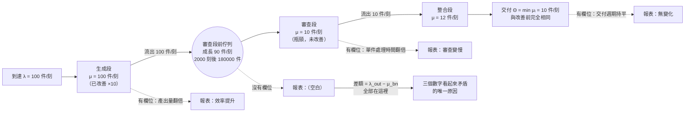

+++
title = "守恆的產線：被改善出來的產能去了哪裡，以及延遲加速與吞吐加速為何是兩個數"
date = "2026-09-14T10:55:04+08:00"
author = "TTL::0"
draft = false
isCJKLanguage = true
description = "依據瓶頸理論與 Amdahl 定律證明串聯系統吞吐受限於瓶頸工站，局部服務率提升只會導致差額在製品向下游線性堆積，嚴格區分單件延遲加速與系統吞吐加速的本質差異。"
tags = [
    "分析論述", # term:AnalyticalEssay
    "機器學習", # term:MachineLearning
    "瓶頸理論", # term:TheoryOfConstraints
    "吞吐守恆", # term:ThroughputConservation
    "在製品位移", # term:WipDisplacement
    "Amdahl 定律", # term:AmdahlSLaw
    "效能宣告", # term:PerformanceClaim
    "在製品", # term:WorkInProgress
  ]
series = ["進不了控制迴路的量：研發治理中的可重複性前提、流動守恆與文字效力"]
[ai_info]
    [ai_info.generation]
        model = "Claude Opus 5"
        agent = "Claude Code VSCode Extension 2.1.270"
    [ai_info.refinement]
        model = "Gemini 3.8 Flash"
        agent = "Antigravity IDE 2.5.5"
+++

<!--more-->

## 導言

有一組觀測值，三個數字單獨看都正常，放在一起看卻矛盾。

第一，某一段工作的產出量在半年內翻了一倍。這個數字來自該段工作本身的計數，準確無誤。第二，下一段工作的處理時間也翻了一倍——不是處理能力下降，而是每一件送進來的東西從進入到被處理完的時間拉長為兩倍。第三，組織層級的交付指標，也就是從一個需求被接受到它抵達使用者手上的週期，完全持平。

三個數字合起來的字面意思是：上游快了一倍，中游慢了一倍，整體沒變。這聽起來像某種抵銷，而抵銷這個詞掩蓋了實際發生的事。

從這組觀測回推，關鍵問題不是「為什麼整體沒變」，而是**多出來的那些產出去哪裡了**。它們確實被生產出來了，第一個數字是真的；它們沒有抵達使用者，第三個數字也是真的。差額必須存在於某個地方，而那個地方沒有出現在任何一份報表上。

答案在一個十分老的結果裡，而這個結果的老不影響它的適用性：串聯系統的通過率由最慢的環節決定。改善一個非最慢的環節不會提升通過率，只會在最慢的環節前面堆積庫存。差額沒有消失，它變成了**在製品**（Work In Progress） <!-- term:WorkInProgress -->。

> [!IMPORTANT]
> **在製品** <!-- term:WorkInProgress --> (Work In Progress): 已進入生產流程但尚未交付完成的所有工作項目總和（簡稱 WIP）；在研發流程中多以未合併程式碼或未驗證構思等無形資訊形式存在。 <!-- anchor:WorkInProgress -->


本文要做的不只是複述這條規律，而是處理一個那條規律成書時不存在的情況：**當某一段的處理能力在短時間內提升一個數量級，而其餘不變時，會發生什麼。** 答案在形式上與漸進的失衡相同，在尺度上完全不同，而尺度的差異足以改變該用什麼方式應對。

---

## 分析

### 兩條被混用的定律：延遲加速與吞吐加速

先把一個常見的混淆拆開，因為它正是那三個數字看起來矛盾的原因。

對於一條由 $n$ 段依序處理的產線，有兩個不同的「加速」可以被計算，而它們的公式不同、上界不同、有時方向也不同。

第一個是**單件延遲加速**。一件工作從進入到離開所需的服務時間是各段服務時間之和 $\sum_i 1/\mu_i$。把第 $k$ 段加速 $s$ 倍後，這個和變小，加速比為

$$
S_{\text{lat}} \;=\; \frac{\sum_i 1/\mu_i}{\sum_{i\ne k} 1/\mu_i + \dfrac{1}{s\,\mu_k}} \;=\; \frac{1}{(1-p) + p/s}, \qquad p = \frac{1/\mu_k}{\sum_i 1/\mu_i}
$$

這正是 [Amdahl，1967 / 《Validity of the single processor approach to achieving large scale computing capabilities》](https://doi.org/10.1145/1465482.1465560) 給出的形式，其上界在 $s\to\infty$ 時為 $1/(1-p)$。

第二個是**系統吞吐加速**。穩態下整條產線每單位時間能完成的件數受最慢的那一段限制：

$$
\Theta \;=\; \min_i \mu_i
$$

把非最慢的第 $k$ 段加速 $s$ 倍，$\min_i \mu_i$ 完全不變，因此 $S_{\text{thr}}=1$。這條性質在排隊網路的形式化處理中是基本結果，其開創性框架見 [Jackson，1957 / 《Networks of Waiting Lines》](https://doi.org/10.1287/opre.5.4.518)。

兩個數的差別解釋了那三個觀測值。第一個觀測量的是某一段的產出速率，那確實提升了；第三個觀測量的是系統吞吐，那受 $\min_i \mu_i$ 約束因此不動。**兩個數字都對，因為它們量的是兩個不同的量。**

而它們之間的差額必須守恆。單位時間內進入瓶頸前佇列的件數是上游流出速率，離開的件數是瓶頸服務率，因此佇列的成長速率為

$$
\frac{\mathrm{d}L_{\text{bn}}}{\mathrm{d}t} \;=\; \lambda_{\text{out}} - \mu_{\text{bn}}
$$

這是一個線性發散，而不是一個趨近某個穩態的過程。只要上游持續以高於瓶頸的速率送件，佇列就持續增長，沒有自然的上界。

**因果機制**：串聯結構使每一件工作必須依序通過所有段。穩態下任一段的流出速率不可能超過其後任一段的處理速率，因此全線的通過率被最小值夾住。

**邊界條件**：若被加速的那一段本身就是最慢的那一段，則 $\min_i \mu_i$ 改變，吞吐確實提升。判別方式很直接：改善之後，等待的隊伍出現在哪裡。仍在原處，改善是真的；移到了下游，改善只是位移。

**反例**：一份宣告「開發效率提升一倍」的季度報告，其依據是程式碼產出量的統計。同一季度內，等待審查的變更數從個位數成長到三位數，而這個數字不在報告裡，因為它不對應任何一個既有欄位。報告在工站層級為真，在系統層級未經驗證。

### 模擬：一個數量級的不對稱衝擊

前一節的推導是解析的。這一節用一個可執行的模型驗證它，並量出堆積的實際規模。

模型是一條三段產線：生成、審查、整合，服務率分別為每刻 10、10、12 件。基準情境的到達率為 10，系統恰好飽和而不堆積。改善情境把生成段的服務率提高到 100，也就是一個數量級，其餘不動，並把到達率同步拉高到 100——這對應「上游的產能真的被用上了」這個實際情況。

程式每一刻都檢查一條守恆**不變式**（Invariant） <!-- term:Invariant -->：進入系統的總件數必須等於已完成件數加上仍在系統內的件數。這條檢查的作用是確保模擬本身沒有憑空產生或吞掉工作，因此後面的堆積數字可以被信任。全部只用 Go 標準函式庫。

> [!IMPORTANT]
> **不變式** <!-- term:Invariant --> (Invariant): 系統在任何合法狀態下都必須成立的斷言，是把評估規則寫成可執行檢查的基本單位。 <!-- anchor:Invariant -->


```go
// 串聯管線：改善非瓶頸工站不提升吞吐，只把差額線性堆積到瓶頸前面。
// 每個時間刻都檢查守恆不變式：到達總數 = 完成總數 + 各站在製品。
package main

import "fmt"

type stage struct {
	name    string
	rate    float64 // 每刻可處理的件數（服務率）
	queue   float64 // 站前佇列
	credit  float64 // 未用盡的處理能力，避免整數截斷失真
	served  float64
}

type line struct {
	stages   []*stage
	arrived  float64
	done     float64
}

func newLine(rates []float64, names []string) *line {
	l := &line{}
	for i, r := range rates {
		l.stages = append(l.stages, &stage{name: names[i], rate: r})
	}
	return l
}

// tick 推進一刻：外部到達進入第一站，各站依服務率把件數推往下一站。
func (l *line) tick(arrivals float64) {
	l.arrived += arrivals
	l.stages[0].queue += arrivals
	for i, s := range l.stages {
		s.credit += s.rate
		move := s.credit
		if move > s.queue {
			move = s.queue
		}
		s.queue -= move
		s.credit -= move
		s.served += move
		if i+1 < len(l.stages) {
			l.stages[i+1].queue += move
		} else {
			l.done += move
		}
	}
}

func (l *line) wip() float64 {
	w := 0.0
	for _, s := range l.stages {
		w += s.queue
	}
	return w
}

// conserved 驗證守恆：進入系統的件數必等於已完成件數加上仍在系統內的件數。
func (l *line) conserved() bool {
	d := l.arrived - (l.done + l.wip())
	return d > -1e-9 && d < 1e-9
}

func run(rates []float64, arrivals float64, ticks int) (float64, float64, float64) {
	names := []string{"生成", "審查", "整合"}
	l := newLine(rates, names)
	for t := 0; t < ticks; t++ {
		l.tick(arrivals)
		if !l.conserved() {
			panic("守恆不變式被破壞")
		}
	}
	return l.done / float64(ticks), l.stages[1].queue, l.wip()
}

func main() {
	const ticks = 2000
	// 基準線：生成 10、審查 10、整合 12；到達率 10，系統恰好飽和
	base := []float64{10, 10, 12}
	// 改善後：只把生成站的服務率提高一個數量級，其餘不動
	fast := []float64{100, 10, 12}

	thBase, qBase, wipBase := run(base, 10, ticks)
	thFast, qFast, wipFast := run(fast, 100, ticks) // 上游加速後到達率同步拉高

	fmt.Printf("基準線  生成=%.0f 審查=%.0f 整合=%.0f  到達率=%.0f\n", base[0], base[1], base[2], 10.0)
	fmt.Printf("        吞吐=%.3f 件/刻   審查站前佇列=%.1f   系統在製品=%.1f\n", thBase, qBase, wipBase)
	fmt.Printf("改善後  生成=%.0f 審查=%.0f 整合=%.0f  到達率=%.0f\n", fast[0], fast[1], fast[2], 100.0)
	fmt.Printf("        吞吐=%.3f 件/刻   審查站前佇列=%.1f   系統在製品=%.1f\n", thFast, qFast, wipFast)

	gain := thFast / thBase
	fmt.Printf("\n生成站服務率放大 %.0f 倍 → 系統吞吐放大 %.3f 倍\n", fast[0]/base[0], gain)

	// 堆積速率：上游流出 − 瓶頸服務率
	rate := 100.0 - 10.0
	fmt.Printf("在製品堆積速率 = 上游流出 %.0f − 瓶頸服務率 %.0f = %.0f 件/刻\n", 100.0, 10.0, rate)
	for _, t := range []int{100, 500, 2000} {
		_, q, _ := run(fast, 100, t)
		fmt.Printf("  第 %4d 刻：審查站前佇列 = %8.0f （線性預測 %8.0f）\n", t, q, rate*float64(t))
	}

	// 兩條不同的定律必須分開算：Amdahl 界的是單件「延遲」，min mu 界的是系統「吞吐」。
	sBase := 1/base[0] + 1/base[1] + 1/base[2] // 單件在三站的服務時間總和
	p := (1 / base[0]) / sBase                 // 可加速部分佔單件服務時間的比例
	amdahl := 1.0 / ((1.0 - p) + p/10.0)
	sFast := 1/fast[0] + 1/fast[1] + 1/fast[2]
	fmt.Printf("\n單件服務時間 %.4f → %.4f 刻；可加速部分佔比 p=%.3f\n", sBase, sFast, p)
	fmt.Printf("Amdahl 延遲加速上界 = %.3f 倍（實測 %.3f 倍）；系統吞吐加速 = %.3f 倍\n",
		amdahl, sBase/sFast, gain)

	if gain > 1.001 {
		panic("改善非瓶頸工站不得提升系統吞吐")
	}
	if qFast < rate*float64(ticks)*0.999 {
		panic("被改善出來的產能必須以在製品形式堆積在瓶頸前面")
	}
	if amdahl < 1.4 || amdahl > 1.5 {
		panic("單件延遲的加速必須是真實且有限的")
	}
	_, q100, _ := run(fast, 100, 100)
	_, q2000, _ := run(fast, 100, 2000)
	if r := q2000 / q100; r < 19.0 || r > 21.0 {
		panic("在製品必須隨時間線性成長")
	}
	if thBase < 9.99 || thBase > 10.01 {
		panic("基準線吞吐必須等於瓶頸服務率")
	}
	fmt.Println("OK: 六項不變式全部通過（含每刻守恆檢查）")
}
```

實際執行的輸出如下：

```text
基準線  生成=10 審查=10 整合=12  到達率=10
        吞吐=10.000 件/刻   審查站前佇列=0.0   系統在製品=0.0
改善後  生成=100 審查=10 整合=12  到達率=100
        吞吐=10.000 件/刻   審查站前佇列=180000.0   系統在製品=180000.0

生成站服務率放大 10 倍 → 系統吞吐放大 1.000 倍
在製品堆積速率 = 上游流出 100 − 瓶頸服務率 10 = 90 件/刻
  第  100 刻：審查站前佇列 =     9000 （線性預測     9000）
  第  500 刻：審查站前佇列 =    45000 （線性預測    45000）
  第 2000 刻：審查站前佇列 =   180000 （線性預測   180000）

單件服務時間 0.2833 → 0.1933 刻；可加速部分佔比 p=0.353
Amdahl 延遲加速上界 = 1.466 倍（實測 1.466 倍）；系統吞吐加速 = 1.000 倍
OK: 六項不變式全部通過（含每刻守恆檢查）
```

輸出的第二組數字是本節的核心。生成段的服務率放大十倍之後，**系統吞吐是 10.000 件/刻，與基準線完全相同，加速比 1.000 倍**。同一時間，審查段前的佇列從 0 成長到 180000 件。

被改善出來的產能沒有消失，它以每刻 90 件的速率堆積在瓶頸前面，而這個速率就是上游流出減去瓶頸服務率。三個時間點的量測——第 100 刻 9000 件、第 500 刻 45000 件、第 2000 刻 180000 件——與線性預測逐點吻合。**這不是一個會趨緩的過程，它沒有上界。**

最後兩行給出那個關於混淆的**量化**（Quantization） <!-- term:Quantization -->答案。同一次改善，單件延遲加速 $1.466$ 倍，系統吞吐加速 $1.000$ 倍。前者是真的：每一件工作在生成段花的時間確實變短了，單件服務時間從 $0.2833$ 刻降到 $0.1933$ 刻。後者也是真的：整條產線每刻完成的件數一件也沒多。**一個宣告「效率提升」的人可以完全誠實地引用 $1.466$，而聽的人會理解成 $1.000$ 那一欄的東西。**

> [!IMPORTANT]
> **量化** <!-- term:Quantization --> (Quantization): 以較少位元表示權重或啟動值，改變數值格點以降低記憶體與計算成本的近似方法。 <!-- anchor:Quantization -->


下圖把差額的流向畫出來，重點在於標示出那個沒有欄位的節點。



圖裡四個虛線節點中有三個對應實際存在的報表欄位，第四個是空的。三個觀測值之所以看起來互相矛盾，原因完全在於第四個節點沒有被量。

**因果機制**：守恆律使進入與離開的差額必須累積在系統內某處。累積的位置由結構決定——它一定在服務率最小的那一段之前，因為那是唯一一處流出小於流入的地方。

**邊界條件**：模擬假設瓶頸段的服務率在觀測期內固定。若瓶頸本身會因為隊伍變長而加速——例如審查者在壓力下降低標準以加快速度——則堆積會趨緩，而代價轉移到產出品質上。這種情況下數字會好看，而問題換了一個沒有欄位的維度存在。

**反例**：一個在瓶頸前面的佇列被發現之後、選擇擴大佇列容量而非提升瓶頸服務率的處理方式。容量擴大讓上游不再被阻塞，於是上游的產出指標更好看，而每一件工作的等待時間更長。這個動作在形式上是把可觀測的阻塞換成不可觀測的等待。

### 判別與應對：三個問題，與它們各自否決的行動

前兩節建立了機制。這一節把它壓縮成可以當場使用的判別程序，並說明每個判別結果所否決的行動。

判別只需要三個問題，而三個問題都不需要估計任何分佈參數。

| 邊界輸入案例 | 關鍵判定條件 | 狀態轉移 | 最終處置結果 |
| :--- | :--- | :--- | :--- |
| 某段產出量翻倍，欲宣告效率提升 | 該段是否為 $\arg\min_i \mu_i$ | 否 → 吞吐不變 | 禁止宣告系統層級提升；改報單件延遲加速並標明其定義 |
| 同上 | 同上 | 是 → $\min_i\mu_i$ 上移 | 可宣告；但須同時報告新的瓶頸位置 |
| 改善後下游等待量上升 | $\lambda_{\text{out}} > \mu_{\text{bn}}$ | 佇列以 $\lambda_{\text{out}}-\mu_{\text{bn}}$ 線性成長 | 改善的效果是成本位移；淨收益需扣除持有成本 |
| 欲進一步加速已改善的那一段 | $S_{\text{thr}}$ 對 $\mu_k$ 的偏導為 $0$ | **無狀態**（Stateless） <!-- term:Stateless -->轉移 | 投入的期望收益為零，應停止 |
| 欲擴大瓶頸前佇列的容量上限 | 容量不改變 $\min_i\mu_i$ | 阻塞轉為等待 | 可觀測的阻塞被換成不可觀測的等待，情況變壞 |
| 欲在瓶頸段增加處理能力 | $\mu_{\text{bn}}$ 上移 | $\min_i\mu_i$ 上移直到次慢段成為新瓶頸 | 收益真實，且有明確的飽和點 |

> [!IMPORTANT]
> **無狀態** <!-- term:Stateless --> (Stateless): 不依賴任何中介追蹤檔、任務完成與否完全由輸出目錄的實體檔案決定的設計，帶來冪等性與韌性。 <!-- anchor:Stateless -->


第四列值得特別注意，因為它是最常見的持續投入方向。一旦某段不再是瓶頸，繼續加速它的邊際吞吐收益嚴格為零——不是遞減，是零。而這類投入之所以會持續，正是因為它的局部指標會持續改善。

第五列則指出一個直覺上像是解決方案、實際上是惡化的動作。擴大佇列容量讓上游不再被回壓，於是上游的阻塞消失、產出指標上升，而每一件工作的等待時間變長。這個動作把一個可觀測的訊號換成了一個不可觀測的成本。

下表把幾種表面現象與其底層病灶並置，用意是讓誤診在診斷階段就被攔下。

| 表面讀數 / 現象 | 底層結構病灶 | 舊代脆弱做法 | 新代嚴格工程防線 |
| :--- | :--- | :--- | :--- |
| 某段產出翻倍而交付週期持平 | 改善落在非瓶頸段，差額變成在製品 <!-- term:WorkInProgress --> | 宣告效率提升，尋找其他解釋交付為何沒動 | 改善宣告必須附下游等待量的變化；未附者不予採信 |
| 下游處理時間翻倍 | 佇列變長使每件的等待時間變長，非處理能力下降 | 檢討下游團隊的效率 | 區分等待時間與服務時間，兩者分開量測與呈現 |
| 上游頻繁被回壓、產能閒置 | 回壓是守恆律的正常表現 | 擴大佇列容量以消除回壓 | 保留回壓作為瓶頸位置的可觀測訊號 |
| 持續加速某段而系統毫無反應 | 該段早已不是 $\arg\min_i\mu_i$ | 加倍投入，認為尚未到臨界點 | 每次投入前重新定位瓶頸；邊際吞吐收益為零即停 |
| 瓶頸段在壓力下「變快了」 | 服務率上升伴隨品質下降 | 視為壓力測試下的潛能釋放 | 同時量測瓶頸段的產出品質，避免把成本換到無欄位的維度 |

**因果機制**：$\Theta=\min_i\mu_i$ 對非最小項的偏導為零，因此非瓶頸段的任何改善都不改變 $\Theta$。這是最小值函數的性質，與系統的具體參數無關。

**邊界條件**：當各段服務率非常接近時，「誰是瓶頸」在統計上不確定，而小幅改善可能確實改變 $\arg\min$。此時判別需要的不是更精確的測量，而是承認瓶頸會隨工作類型漂移，並改以各段的等待量分佈來定位。

**反例**：一個把三段服務率調到幾乎相等、然後宣稱「已經沒有瓶頸」的產線。服務率相等意味著任何一段的隨機波動都會讓它暫時成為瓶頸，於是在製品 <!-- term:WorkInProgress -->在三段之間來回移動而總量不降。平衡產線在有變異的系統裡不是最佳解，而是把單一明確的瓶頸換成三個間歇的瓶頸。

---

## 反思

這套分析裡真正屬於本文的部分只有尺度，機制的部分是舊的。串聯系統的通過率受最慢環節限制，這條結果比多數在用的工程實務都老，而它從未被推翻。

值得停留的是尺度本身。既有的框架隱含一個假設：各段的處理能力都受限於人力配置，因此產能失衡是漸進的、幅度有限的。一段的服務率相對其他段提高百分之二十是常態，提高一個數量級不是。

當幅度變成一個數量級時，有兩件事改變。第一，堆積速率從「略高於瓶頸服務率」變成「九倍於瓶頸服務率」，因此從發生到造成明顯後果的時間尺度從季縮短到週。第二，也更重要的是，**原本用來偵測失衡的手段失效了**。人會注意到隊伍在變長，前提是隊伍的成長速度落在人的感知範圍內；每刻 90 件的成長速度超出了任何依賴定期檢視的偵測方式。

這推出一個不太舒服的結論：既有的應對手段——定期檢討、看板回顧、季度盤點——其偵測頻率是為漸進失衡設計的。當失衡的時間常數縮短一個量級時，這些手段不是效果打折，而是永遠在報告一個已經過期的狀態。

第三件值得記下的事關於「這是不是舊結論套新工具」這個合理質疑。誠實的回答是：機制部分確實是搬運，本文沒有提出新機制。差別在於那個關於產能受限於人力的假設——它在既有框架成書時是對的，而它現在不是。**理論不變，實例是新的。** 這是一個比「發現新機制」弱的主張，而它是誠實的那一個；一個被既有理論正確預測、卻仍然發生的案例，其價值不低於一個新機制。

最後一個觀察關於那個延遲加速與吞吐加速的分岔。$1.466$ 與 $1.000$ 這兩個數在同一次改善裡同時成立，而日常語言裡只有一個詞——「快了」。這使得誤傳不需要任何人有意誤導：說話的人心裡想的是第一個數，聽話的人理解成第二個數，而兩人都沒有說錯話。**要避免這種誤傳，唯一可行的做法是在宣告加速時強制標明它是哪一個量的加速**，而這是一個文件格式的決定，不是一個溝通態度的問題。

---

## 實務對比

**其一：改善宣告的範圍**

錯誤的作法是在某一段的處理速度提升之後宣告整體效率提升。那個宣告在該段層級為真，在系統層級未經驗證，而兩者的差額以在製品 <!-- term:WorkInProgress -->的形式存在於一個沒有欄位的地方。

正確的作法是把宣告拆成兩個並置的數字：這一段的單件延遲加速，以及同期系統吞吐的變化。判準是：若下游的等待量在同期上升，那麼改善的效果是把成本從一段移到另一段，而不是消除它。兩個數字並置之後，誤傳不需要靠溝通技巧來避免。

**其二：上游被回壓時的處理**

錯誤的作法是擴大瓶頸前的佇列容量，讓上游不再閒置。這個動作消除了一個令人不適的現象，而它保留了造成該現象的原因，並把可觀測的阻塞換成不可觀測的等待。

正確的作法是把回壓當成訊號而不是故障——它正在告訴你瓶頸在哪裡。應對方式是把上游騰出的產能轉向瓶頸段，或者直接讓上游降速。判準是：這個動作會讓 $\min_i\mu_i$ 上移嗎。不會，它就只是在搬東西。

**其三：持續投入的停止條件**

錯誤的作法是在某個方向已經投入並看到局部指標改善之後持續加碼，因為局部指標會一直改善。

正確的作法是在每一次投入之前重新定位瓶頸，並把「該段是否為當前瓶頸」設為投入的**前置條件**（Prerequisite） <!-- term:Prerequisite -->。判準很直接：這段再快一倍，交付週期會不會變。不會，那麼這筆投入的期望吞吐收益嚴格為零，而它的局部指標仍然會變好看——這正是它容易持續的原因。

> [!IMPORTANT]
> **前置條件** <!-- term:Prerequisite --> (Prerequisite): 執行某項開發活動之前必須滿足的準備工作或狀態。 <!-- anchor:Prerequisite -->


---

## 結論

串聯系統的通過率由最慢的環節決定，因此改善非最慢的環節不提升通過率，只增加在製品 <!-- term:WorkInProgress -->。

由此得到三個可遷移的判斷。第一，同一次改善有兩個都正確的加速比：單件延遲加速由可加速部分的佔比決定，系統吞吐加速在被改善者非瓶頸時恆為一。日常語言裡只有一個「快了」，因此誤傳不需要任何人有意誤導，而防止它的唯一可行做法是在宣告時強制標明量的種類。第二，差額守恆，它以 $\lambda_{\text{out}}-\mu_{\text{bn}}$ 的速率線性累積在瓶頸前面，沒有自然上界；這個累積的位置由結構決定，而它通常沒有對應的報表欄位——那正是幾個各自正確的觀測值看起來互相矛盾的原因。第三，當產能不對稱的幅度達到一個數量級時，機制不變而時間常數縮短一個量級，於是所有依賴定期檢視的偵測手段都會在一個已經過期的狀態上運作。

宣告效率提升之前，只需要回答一個問題：改善之後，等待的隊伍出現在哪裡。答案若是「下游」，那麼被改善的不是系統，是它的一段。