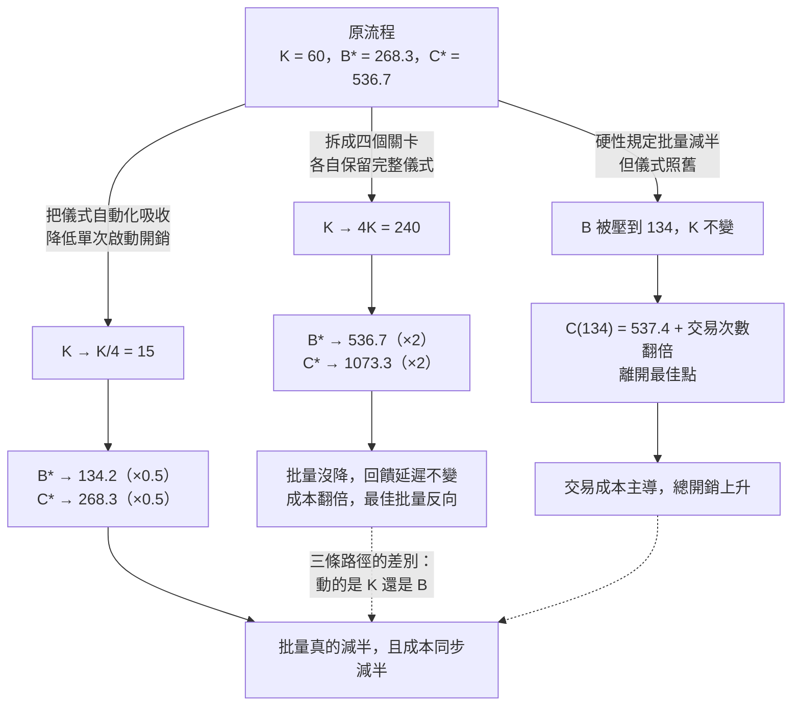

+++
title = "平方根律下的批量：為什麼速度與品質不是取捨，以及四個關卡為何使成本恰好翻倍"
date = "2026-09-14T11:20:05+08:00"
author = "梅乾"
draft = false
isCJKLanguage = true
description = "藉由固定交易成本與持有延遲成本的對偶推導平方根律，證明偽拆分關卡如何在不縮減批量的情況下成倍推升固定開銷，指出降低單批固定交易成本才是縮減批量的唯一出路。"
tags = [
    "分析論述", # term:AnalyticalEssay
    "批量經濟", # term:BatchEconomics
    "交易成本", # term:TransactionCost
    "回饋延遲", # term:FeedbackDelay
    "流程設計", # term:ProcessDesign
    "平方根律", # term:SquareRootLaw
    "不變式", # term:Invariant
  ]
series = ["進不了控制迴路的量：研發治理中的可重複性前提、流動守恆與文字效力"]
[ai_info]
    [ai_info.generation]
        model = "Claude Opus 5"
        agent = "Claude Code VSCode Extension 2.1.270"
    [ai_info.refinement]
        model = "Gemini 3.8 Flash"
        agent = "Antigravity IDE 2.5.5"
+++

<!--more-->

## 導言

一個流程要求：在開始實作之前，必須先完成提案、規格、技術設計、任務拆解四份產物，每一份都要通過審查並取得簽核。

這個流程的設計理由很清楚，而且合理。先想清楚再動手可以避免返工；四份產物構成完整的決策紀錄；每一份都有明確的作者與簽核者，因此責任可追溯。三個理由都成立。

實際發生的事是：第一個能夠揭露設計錯誤的訊號——也就是有人真的動手實作並撞上一個沒想到的情況——出現在流程啟動的四到六週之後。而在那四到六週裡，四份產物已經彼此交叉引用、已經被簽核、已經成為後續工作的基準。此時發現的錯誤不只要改一處，要改四處，還要重跑四次審查。

有人提出改善方案：把大關卡拆成四個小關卡，每份產物完成就先審一次，這樣可以早點發現問題。方案被採納，四個獨立的審查會議被建立起來，每個都有自己的議程、自己的出席名單、自己的簽核欄位。六個月後回頭看，第一個實作訊號出現的時間沒有提前，而流程的總開銷明顯上升。

從這個結果回推，值得問的不是「為什麼拆分沒有用」，而是**那次拆分到底改變了什麼量**。答案是：它改變了每一批的固定開銷，而沒有改變批量本身。這兩個量在成本函數裡的位置不同，而它們的關係恰好可以被算出來——算出來的結果是一個乾淨的常數。

本文要建立的是批量的成本結構，並證明兩件事。第一，速度與品質在批量這個維度上不構成取捨，大批量同時傷害兩者。第二，那次「拆成四個關卡」的改動使最低總成本恰好變成兩倍，而最佳批量反而變成兩倍——方向與「縮小批量」完全相反。

---

## 分析

### 兩條反向的成本曲線，與它們的交點

先把批量的成本結構寫出來，因為整篇的結論都由它推出。

設某段期間內需要處理的工作量為 $D$ 件，每次以批量 $B$ 件送出，因此期間內共有 $D/B$ 個批次。成本有兩項，方向相反。

第一項是**交易成本**（Transaction Cost） <!-- term:TransactionCost -->：每一個批次不論大小都要支付的固定開銷——切換脈絡、召集相關的人、準備材料、啟動審查、收斂結論。設每批次的交易成本 <!-- term:TransactionCost -->為 $K$，則期間內的總交易成本 <!-- term:TransactionCost -->為 $(D/B)\cdot K$，隨批量遞減。

> [!IMPORTANT]
> **交易成本** <!-- term:TransactionCost --> (Transaction Cost): 啟動一次交付或批次處理所需投入的固定開銷（如設定、審查、會議、儀式等），與該批次包含的工作量無關。 <!-- anchor:TransactionCost -->


第二項是**持有暨延遲成本**：工作完成了但還沒被送出時，它產生的價值被推遲，而且它有被後續變更作廢的風險。批量為 $B$ 時，平均在手的存量約為 $B/2$；設單位存量的單位時間成本為 $h$，則這一項為 $h\cdot B/2$，隨批量遞增。

兩項相加：

$$
C(B) \;=\; \frac{D}{B}K + \frac{hB}{2}
$$

對 $B$ 微分並令其為零，得到最佳批量與最低總成本：

$$
B^\ast = \sqrt{\frac{2DK}{h}}, \qquad C^\ast = C(B^\ast) = \sqrt{2DKh}
$$

這組結果的原始推導出自庫存管理的奠基工作，[Harris，1913 / 《How Many Parts to Make at Once》](https://doi.org/10.1287/opre.38.6.947) 給出了它的最早形式，該文後由 *Operations Research* 於 1990 年重印。

$C^\ast$ 的形式是本文所有結論的來源：**最低總成本是三個參數乘積的平方根。** 平方根意味著任何一個參數的倍率變化，會以其平方根的倍率傳遞到成本上。這條性質稍後會給出那個恰好等於二的常數。

**因果機制**：兩項成本對 $B$ 的依賴方向相反且皆為單調，因此總和是凸的，存在唯一內點極小值。這是兩個單調反向函數求和的一般性質。

**邊界條件**：模型假設 $K$ 與 $h$ 在關心的批量範圍內是常數。當批量大到需要額外的協調層級時 $K$ 會隨 $B$ 上升，此時最佳批量比公式給的更小。模型在這個方向上是保守的。

**反例**：一個把批量壓到極小、每完成一行變更就走一次完整審查流程的團隊。持有成本幾乎為零，而交易成本 <!-- term:TransactionCost -->項 $(D/B)K$ 爆炸，總開銷遠高於中等批量。縮小批量有下限，而下限由 $K$ 決定。

### 速度與品質在批量上不是取捨

前一節的 $h$ 被寫成一個係數，而它的內部結構值得展開，因為那裡藏著一個常見的誤解。

延遲的成本不只是價值被推遲，還包括**錯誤在被發現之前累積**。一個設計決定若在做出後立刻被驗證，錯的話只需要改那一個決定；若在四週後才被驗證，這四週裡建立在它之上的所有東西都要一起改。

這條關係的形狀是超線性的。設**回饋延遲**（Feedback Delay） <!-- term:FeedbackDelay -->為 $d$，而錯誤修正成本隨延遲以指數 $\alpha>1$ 成長：

> [!IMPORTANT]
> **回饋延遲** <!-- term:FeedbackDelay --> (Feedback Delay): 從某個動作或決策被執行，到系統產生可觀測結果並被決策者感知之間的時間差。 <!-- anchor:FeedbackDelay -->


$$
E(d) \;\propto\; d^{\alpha}, \qquad d \;\propto\; B
$$

由於回饋延遲 <!-- term:FeedbackDelay -->與批量成正比，錯誤成本隨批量以 $B^{\alpha}$ 成長。$\alpha>1$ 這一點很關鍵：它意味著批量翻倍時，錯誤成本不只是翻倍。

現在把兩件事並置。批量增大時，流動成本 $C(B)$ 在超過 $B^\ast$ 之後上升——這是速度變差；同時錯誤成本 $B^{\alpha}$ 上升——這是品質變差。**兩者同向，因此在批量這個維度上不存在速度與品質的取捨。**

這與日常直覺相反。日常直覺說「慢工出細活」，因此把流程拉長、產物做厚、審查加密，應該換到更好的品質。這個直覺在單一工序內成立——多花時間檢查同一份東西，確實比較不容易出錯。它在批量維度上不成立，因為批量增大並沒有讓任何一份東西被更仔細地檢查，只是讓更多份東西在被檢查之前先被生產出來。

下面這段程式把兩條成本曲線、解析解與數值解的一致性、以及「拆成四個關卡」的實際效果一起算出來。全部只用 Python 標準函式庫。

```python
"""批量的平方根律，以及『拆成四個保留完整儀式的關卡』為何不是縮小批量。"""
import math

D = 1200.0     # 每期需求件數
K = 60.0       # 每批次的固定交易成本（切換、溝通、審查啟動）
H = 2.0        # 每件每期的持有暨延遲成本

def total_cost(B, k=K, d=D, h=H):
    """C(B) = (D/B)·K + h·B/2：左項隨批量遞減，右項隨批量遞增。"""
    return (d / B) * k + h * B / 2.0

def analytic(k=K, d=D, h=H):
    """B* = sqrt(2DK/h)，代回得 C* = sqrt(2DKh)。"""
    return math.sqrt(2 * d * k / h), math.sqrt(2 * d * k * h)

def numeric(k=K, d=D, h=H, lo=1.0, hi=2000.0):
    """三分搜尋數值最小化，用來獨立驗證解析解。"""
    for _ in range(400):
        m1, m2 = lo + (hi - lo) / 3, hi - (hi - lo) / 3
        if total_cost(m1, k, d, h) < total_cost(m2, k, d, h):
            hi = m2
        else:
            lo = m1
    B = (lo + hi) / 2
    return B, total_cost(B, k, d, h)

Ba, Ca = analytic(); Bn, Cn = numeric()
print(f"單一批次流程   解析解 B*={Ba:.3f} C*={Ca:.3f} ｜ 數值解 B={Bn:.3f} C={Cn:.3f}")

# 偽拆分：四份產物各自保留完整儀式，因此每批次的交易成本變成 4K；
# 但實作仍須等四份全部完成才能開始，批量 B 沒有下降。
Bs, Cs = analytic(k=4 * K)
print(f"四關卡偽拆分   解析解 B*={Bs:.3f} C*={Cs:.3f}"
      f"   → 最佳批量 ×{Bs/Ba:.3f}，最低總成本 ×{Cs/Ca:.3f}")

# 真正的縮批：把儀式自動化掉，讓每批次交易成本降為四分之一
Br, Cr = analytic(k=K / 4)
print(f"交易成本降四倍 解析解 B*={Br:.3f} C*={Cr:.3f}"
      f"   → 最佳批量 ×{Br/Ba:.3f}，最低總成本 ×{Cr/Ca:.3f}")

# 在固定批量下強行拆關卡：批量維持 B*，只是交易成本翻四倍
print(f"\n固定批量 B={Ba:.1f} 時：原流程 C={total_cost(Ba):.2f}，"
      f"偽拆分 C={total_cost(Ba, k=4*K):.2f}（+{total_cost(Ba,k=4*K)/total_cost(Ba)-1:.1%}）")

# 回饋延遲與錯誤成本：延遲 ∝ B，錯誤成本 ∝ 延遲^1.5（超線性）
print(f"\n{'批量 B':>8} {'回饋延遲':>10} {'錯誤成本 ∝ d^1.5':>18} {'流動成本 C(B)':>15}")
for B in (25, 50, 190, 400, 800):
    d = B / D
    print(f"{B:8d} {d:10.4f} {d**1.5*1e4:18.3f} {total_cost(float(B)):15.3f}")

assert abs(Ba - Bn) < 1e-3 and abs(Ca - Cn) < 1e-6, "解析解與數值解必須一致"
assert math.isclose(Cs / Ca, 2.0, rel_tol=1e-9), "交易成本 ×4 → 最低總成本恰為 ×2（平方根律）"
assert math.isclose(Bs / Ba, 2.0, rel_tol=1e-9), "交易成本 ×4 → 最佳批量反而 ×2，與『縮批』方向相反"
assert math.isclose(Cr / Ca, 0.5, rel_tol=1e-9), "交易成本 ÷4 → 最低總成本恰為 ÷2"
assert math.isclose(Br / Ba, 0.5, rel_tol=1e-9), "交易成本 ÷4 → 最佳批量才真的減半"
assert total_cost(Ba, k=4 * K) > total_cost(Ba), "固定批量下拆關卡只增加成本"
assert (25 / D) ** 1.5 / (800 / D) ** 1.5 < 25 / 800, "錯誤成本必須隨延遲超線性成長"
print("OK: 七項不變式全部通過")
```

實際執行的輸出如下：

```text
單一批次流程   解析解 B*=268.328 C*=536.656 ｜ 數值解 B=268.328 C=536.656
四關卡偽拆分   解析解 B*=536.656 C*=1073.313   → 最佳批量 ×2.000，最低總成本 ×2.000
交易成本降四倍 解析解 B*=134.164 C*=268.328   → 最佳批量 ×0.500，最低總成本 ×0.500

固定批量 B=268.3 時：原流程 C=536.66，偽拆分 C=1341.64（+150.0%）

    批量 B       回饋延遲       錯誤成本 ∝ d^1.5       流動成本 C(B)
      25     0.0208             30.070        2905.000
      50     0.0417             85.052        1490.000
     190     0.1583            630.026         568.947
     400     0.3333           1924.501         580.000
     800     0.6667           5443.311         890.000
```

最後那張表把「速度與品質不是取捨」這件事直接攤開。從批量 190 移到 800，流動成本從 $568.947$ 上升到 $890.000$，錯誤成本從 $630.026$ 上升到 $5443.311$。**兩欄同向上升，而且後者的漲幅是前者的十倍以上。** 不存在一個「用速度換品質」的區間，因為往大批量走的方向兩者都變壞。

表的另一端同樣有資訊。從 190 移到 25，錯誤成本從 $630.026$ 降到 $30.070$，而流動成本從 $568.947$ 暴增到 $2905.000$。這是縮小批量的真實下界——它存在，而且它由 $K$ 決定，不由意志力決定。

**因果機制**：回饋延遲 <!-- term:FeedbackDelay -->與批量成正比，而錯誤修正成本隨延遲超線性成長。兩者複合後，錯誤成本隨批量以高於一次的冪次成長，與流動成本在大批量端同向。

**邊界條件**：此結論在 $B>B^\ast$ 的區間成立。在 $B<B^\ast$ 的區間，錯誤成本繼續下降而流動成本上升，此時確實存在取捨——只是取捨的兩端是「交易開銷」與「錯誤成本」，不是「速度」與「品質」。

**反例**：一個以「提高品質」為由把設計評審從兩週一次改為六週一次、每次審更多內容的團隊。每次會議的深度確實增加，而每一個設計決定平均要等三週才被檢視。六週後被指出的問題，其修正範圍是兩週時的數倍，而會議紀錄顯示「本次審查發現的問題數大幅上升」——這個數字被當成評審變得更有效的證據。

### 四個關卡：一個恰好等於二的常數

現在回到開頭那個改善方案，並把它的效果算出來。

原流程是：四份產物全部完成後，一次審查、一次簽核、一次進入實作。改善後是：每份產物完成就審一次，四次審查各自獨立，而每次審查都保留完整的儀式——自己的議程、自己的出席名單、自己的簽核欄位。

關鍵在於實作的啟動條件沒有改變。實作仍然要等四份全部完成，因為第四份是任務拆解，而任務拆解是實作的輸入。因此：

- **批量 $B$ 不變**：仍然是「四份產物」這一整包，回饋延遲 <!-- term:FeedbackDelay -->一天也沒縮短。
- **交易成本 <!-- term:TransactionCost --> $K$ 變成 $4K'$**：四次審查各自支付完整的啟動開銷，而 $K'\approx K$。

把 $K\to 4K$ 代入**平方根律**（Square Root Law） <!-- term:SquareRootLaw -->：

> [!IMPORTANT]
> **平方根律** <!-- term:SquareRootLaw --> (Square Root Law): 經濟訂購量（EOQ）模型中最佳批量與固定開銷與持有成本比值之平方根成正比的數學關係。 <!-- anchor:SquareRootLaw -->


$$
\frac{C^\ast_{\text{split}}}{C^\ast} = \frac{\sqrt{2D(4K)h}}{\sqrt{2DKh}} = \sqrt{4} = 2, \qquad
\frac{B^\ast_{\text{split}}}{B^\ast} = \frac{\sqrt{2D(4K)/h}}{\sqrt{2DK/h}} = 2
$$

輸出的第二行證實了這兩個比值：最低總成本 $\times 2.000$，最佳批量 $\times 2.000$。

兩個 $2$ 的意義不同，而第二個更值得注意。這次改動不只沒有縮小批量，它還讓**最佳批量變成原來的兩倍**——也就是說，在新的成本結構下，理性的做法是把批次做得更大而不是更小。改善方案的名義目標是縮小批量，而它的實際效果是把最佳批量往相反方向推了一倍。

第三行則給出真正有效的那條路徑。把儀式自動化掉，讓每批次的交易成本 <!-- term:TransactionCost -->降為四分之一，於是最佳批量減半、最低總成本也減半。**能動的旋鈕是 $K$ 不是 $B$**：$B$ 是 $K$ 的函數，直接壓 $B$ 而不動 $K$ 只會讓成本離開最佳點。

第四行是最直接的一擊。在批量被硬性維持在原最佳值 $268.3$ 的情況下，偽拆分把總成本從 $536.66$ 推到 $1341.64$，**上升百分之一百五十**。

下圖把三條路徑並排，並標出唯一一條會降低成本的。



圖的三條分支從同一個節點出發，而只有第三條同時達成「批量下降」與「成本下降」。前兩條各自實現了名義目標的一半，代價都落在另一半上。

下表用一次完整的走查呈現同一個流程在不同干預下的參數與結果。

| 邊界輸入案例 | 關鍵判定條件 | 狀態轉移 | 最終處置結果 |
| :--- | :--- | :--- | :--- |
| 原流程，四份產物一次送出 | $K=60$，$D=1200$，$h=2$ | $B^\ast=268.3$ | $C^\ast=536.7$；回饋延遲 <!-- term:FeedbackDelay --> $=B/D$ |
| 拆成四關卡，儀式全保留 | 實作啟動條件未變 $\Rightarrow B$ 不變；$K\to 4K$ | $B^\ast\to 536.7$ | $C^\ast\to 1073.3$，恰為兩倍；最佳批量反向加倍 |
| 固定批量硬拆四關卡 | $B$ 鎖在 $268.3$，$K\to 4K$ | 無最佳化空間 | $C$ 由 $536.66$ 升至 $1341.64$，$+150\%$ |
| 行政命令要求批量減半 | $B\to 134$，$K$ 不變 | 偏離 $B^\ast$ | 交易成本 <!-- term:TransactionCost -->項翻倍，總成本高於最佳點 |
| 把四次審查的啟動開銷自動化 | $K\to K/4$ | $B^\ast\to 134.2$ | $C^\ast\to 268.3$，兩者同步減半 |
| 實作可在第一份產物後啟動 | 啟動條件改變 $\Rightarrow B\to B/4$ | 回饋延遲 <!-- term:FeedbackDelay -->降為四分之一 | 錯誤成本以 $4^{1.5}\approx 8$ 倍的比例下降 |

最後一列指出真正的拆分是什麼樣子：**它改變的是實作的啟動條件，不是審查的次數。** 一次真的縮小批量的改動，必然讓某件下游的事可以更早開始；若沒有任何下游的事提前開始，那次改動就不是縮批。

下表把幾種表面現象與其底層病灶並置，用意是讓誤診在診斷階段就被攔下。

| 表面讀數 / 現象 | 底層成本結構病灶 | 舊代脆弱做法 | 新代嚴格工程防線 |
| :--- | :--- | :--- | :--- |
| 增加了檢查點而回饋時間沒有提前 | 下游啟動條件未變，$B$ 不變而 $K\to 4K$ | 再增加一個更早的檢查點 | 以「哪件下游工作提前開始」為改動的驗收條件 |
| 規定批量上限後總開銷上升 | $B$ 被壓離 $B^\ast=\sqrt{2DK/h}$，交易成本 <!-- term:TransactionCost -->項爆炸 | 歸因為「小批量不適合我們」並撤回 | 先削減單批固定開銷，讓 $B^\ast$ 自然下移 |
| 評審頻率降低而每次發現的問題數上升 | 等待時間變長使錯誤以 $B^{\alpha}$ 累積 | 視為評審變得更有效的證據 | 量測「決定到第一個推翻證據」的平均延遲，而非每次會議的發現數 |
| 流程改善後儀式總時數增加 | 每個新關卡各自支付完整的 $K$ | 以「更嚴謹」解釋時數上升 | 改動前後各量一次每週啟動與收斂總時數 |
| 交易成本 <!-- term:TransactionCost -->削減四倍而總成本只降一半 | $C^\ast=\sqrt{2DKh}$ 對 $K$ 的依賴是平方根 | 認定削減無效而停止投入 | 把錯誤成本的 $2^{\alpha}$ 倍下降一併計入效益評估 |


**因果機制**：$C^\ast=\sqrt{2DKh}$ 對 $K$ 的依賴是 $\sqrt{K}$，因此 $K$ 的四倍變化傳遞為成本的兩倍變化。這是平方根函數的性質，與具體參數值無關，所以那個 $2$ 是一個常數而非巧合。

**邊界條件**：若四次審查中有幾次的儀式被真正簡化——例如第一次審查只需要兩個人花十分鐘——則 $K$ 的總和小於 $4K$，成本倍率小於 $2$。關鍵不在關卡數量，在每個關卡是否保留完整的啟動開銷。

**反例**：一個把四個審查關卡合併回一次、以為這樣就回到原點的團隊。合併確實把 $K$ 降回原值，而此時如果批量已經因為前一階段的 $B^\ast$ 上移而被調大，成本會停在一個比原點更高的位置。參數的調整有路徑依賴，回滾一個動作不保證回到原狀態。

---

## 反思

本文的結論指向一個與直覺相反的優先順序：**在批量上做文章之前，先在交易成本 <!-- term:TransactionCost -->上做文章。** 理由是 $B^\ast$ 是 $K$ 的函數，因此直接下令縮小批量而不動 $K$，等於命令系統離開它的最佳點。

這解釋了一個常見的失敗模式。許多組織在理解「小批量比較好」之後，把它寫成一條政策——批次不得超過某個大小——而沒有動任何一次審查的啟動開銷。結果是交易成本 <!-- term:TransactionCost -->項按比例上升，總開銷變差，而政策被歸因為「不適合我們的情境」後撤回。政策的方向是對的，執行的順序是反的。

第二個反思關於那個平方根。$C^\ast=\sqrt{2DKh}$ 的平方根形式有一個令人略感洩氣的含意：**降低交易成本 <!-- term:TransactionCost -->的收益是次線性的。** 把 $K$ 砍到四分之一只換來成本減半，而不是減到四分之一。這意味著在 $K$ 上的投入有遞減報酬，而且遞減得相當快。

不過這個洩氣有一個限度，因為 $K$ 的下降還透過另一條路徑產生收益：$B^\ast$ 同步減半，而回饋延遲 <!-- term:FeedbackDelay -->正比於 $B$，錯誤成本正比於 $B^{\alpha}$ 且 $\alpha>1$。因此 $K$ 減四倍帶來的錯誤成本下降幅度是 $2^{\alpha}$ 倍——以 $\alpha=1.5$ 計約為 $2.8$ 倍。**流動成本的收益是次線性的，錯誤成本的收益是超線性的**，而後者通常沒有被計入任何一次流程改善的效益評估裡。

第三件值得記下的事關於「什麼算是真的拆分」。本文給出的判準很窄：一次改動若沒有讓任何下游工作可以更早開始，它就不是縮批。這個判準排除了絕大多數以「增加檢查點」為形式的改善案，因為增加檢查點通常不改變下游的啟動條件。而它也給出了一條可行的路徑——**去改啟動條件本身**，例如讓實作在第一份產物完成後就可以開始探索，而不必等到第四份。

最後一個觀察關於這套分析的邊界。整套模型假設 $K$ 與 $h$ 是外生的常數，而實際上 $K$ 有一部分是組織自己選擇的。一次審查需要六個人出席兩小時，這不是物理定律，是一個被沿用的慣例。因此 $K$ 的真實值裡有一部分是可以被直接刪除的，而刪除它不需要任何工具，只需要有人有權決定誰不必出席。這一部分的降低成本最低、收益最直接，而它通常最後才被碰。

---

## 實務對比

**其一：批量政策的執行順序**

錯誤的作法是先下令「單次變更不得超過某個規模」，並期待這條規定自然帶來更快的回饋。在交易成本 <!-- term:TransactionCost -->未變的前提下，這條規定把系統推離最佳批量，交易成本 <!-- term:TransactionCost -->項按比例上升而總開銷變差。

正確的作法是先量一次單批的啟動開銷——多少人、多少時間、多少準備工作——並先削減它。批量會在新的成本結構下自然下移，而且下移的幅度可以事先算出來。判準是：這條政策實施後，每週用於啟動與收斂的總時數會變成多少。變多了，方向就是反的。

**其二：辨識偽拆分**

錯誤的作法是把一個大關卡拆成四個小關卡並稱之為縮小批量。若下游的啟動條件沒有改變，回饋延遲 <!-- term:FeedbackDelay -->一天也沒有縮短，而每批次的固定開銷變成四倍。

正確的作法是問一個具體的問題：這次改動之後，有沒有任何一件下游的工作可以比以前更早開始？答不出具體的那件事，這次改動就不是縮批，而是把一個開銷拆成四個開銷。判準是：第一個能夠揭露錯誤的實作訊號，出現的時間有沒有提前。

**其三：品質改善方案的方向檢查**

錯誤的作法是以「提高品質」為由降低評審頻率並加大每次的審查範圍。每次會議的深度確實增加，而每個決定被檢視前的平均等待時間同步增加，錯誤成本以超線性的比例上升。

正確的作法是把「每次審查的深度」與「每個決定的等待時間」分開看，並承認後者是錯誤成本的主要驅動項。判準是：一個今天做出的設計決定，平均要等多久才會遇到第一個可能推翻它的證據。這個數字變長時，品質在變差，無論每次會議開得多深入。

---

## 結論

批量的成本由兩條反向曲線決定，而最低總成本是需求量、交易成本 <!-- term:TransactionCost -->與持有成本三者乘積的平方根。

由此得到三個可遷移的判斷。第一，在批量這個維度上不存在速度與品質的取捨：批量增大時流動成本與錯誤成本同向上升，而後者因為回饋延遲 <!-- term:FeedbackDelay -->的超線性效應上升得更快。日常直覺說「慢工出細活」，那個直覺在單一工序內成立，在批量維度上不成立——大批量並沒有讓任何一份東西被更仔細地檢查。第二，能動的旋鈕是每批次的固定開銷而不是批量本身，因為最佳批量是前者的函數；把一個關卡拆成四個而各自保留完整儀式，會使最低總成本恰好變成兩倍，且最佳批量同步加倍——方向與縮批完全相反，而這個 $2$ 是平方根律 <!-- term:SquareRootLaw -->給出的常數，不是巧合。第三，判斷一次改動是不是真的縮批只需要一個問題：有沒有任何一件下游工作因此可以更早開始。

流程改善提案送出之前，先算一次：這次改動讓每批次的固定開銷變成多少，讓第一個揭露錯誤的訊號提前多久。兩個數字都答不出來時，這個提案改變的是儀式的形狀，不是成本的結構。