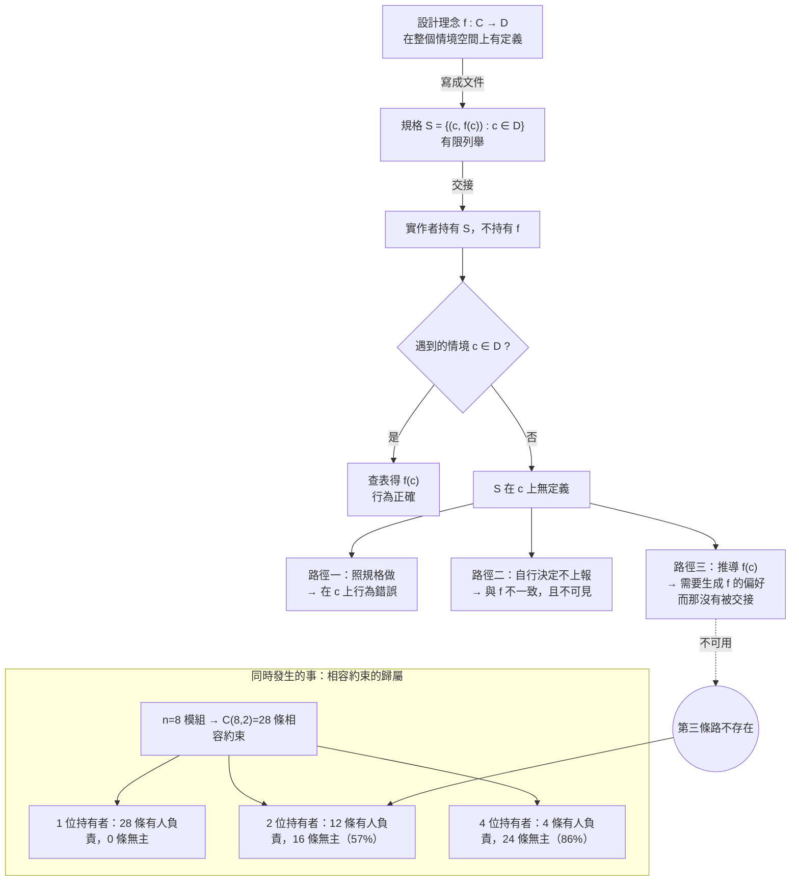

+++
title = "規格是一張查表：設計理念的全函數性質，與交接處丟失的那個定義域"
date = "2026-09-14T11:45:06+08:00"
author = "TTL::0"
draft = false
isCJKLanguage = true
description = "將設計理念形式化為定義於全情境的全函數，指出規格僅是有限定義域上的偏函數查表，揭示分工交接時未定義域外推失敗與跨模組相容約束失去持有者的結構性根源。"
tags = [
    "分析論述", # term:AnalyticalEssay
    "AI 經濟與社會", # term:AiEconomics
    "規格設計", # term:SpecificationDesign
    "概念完整性", # term:ConceptualIntegrity
    "偏函數", # term:PartialFunction
    "窮盡性檢查", # term:ExhaustivenessCheck
    "職責劃界", # term:ResponsibilityBoundary
    "流程設計", # term:ProcessDesign
  ]
series = ["進不了控制迴路的量：研發治理中的可重複性前提、流動守恆與文字效力"]
[ai_info]
    [ai_info.generation]
        model = "Claude Opus 5"
        agent = "Claude Code VSCode Extension 2.1.270"
    [ai_info.refinement]
        model = "Gemini 3.8 Flash"
        agent = "Antigravity IDE 2.5.5"
+++

<!--more-->

## 導言

一條典型的角色鏈長這樣：第一個角色寫提案與規格，第二個角色寫技術設計與任務拆解，第三個角色驗證交付物，第四個角色促進流程的推進。四個角色各有明確的產出、明確的簽核欄位、明確的責任範圍。

這條鏈在紙上很乾淨，而它有一個具體的失效方式，且該失效每次都以同一個形狀出現。實作者遇到一個規格沒有涵蓋的情況——某個條件分支的失敗路徑、某個併發下的競態、某個上游從未考慮過的輸入——然後它必須決定怎麼辦。此時它有兩條路：照著規格做出一個在那個情況下行為錯誤的東西，或者自己決定一個處理方式而不上報。

值得注意的不是這個困境存在，而是**第三條路為什麼不存在**。第三條路應該是「推導出寫規格的人在這個情況下會怎麼決定」，而這條路需要的東西沒有被交接過來。

再往下回推一層會更有意思。這條角色鏈的設計者通常讀過「**概念完整性**（Conceptual Integrity） <!-- term:ConceptualIntegrity -->需要由少數幾個心智持有」這類主張，並認為自己遵守了它——畢竟寫規格的只有一個人。而實際上這條鏈把構思切成了兩半：「系統應該做什麼」由第一個角色決定，「要如何達成」由第二個角色決定，**兩者都是構思**，中間隔著一次交接。

> [!IMPORTANT]
> **概念完整性** <!-- term:ConceptualIntegrity --> (Conceptual Integrity): 系統各部分共同遵循一致設計理念與取捨邏輯的性質。 <!-- anchor:ConceptualIntegrity -->


本文要做的是把這件事從一個價值判斷改寫成一個可檢查的形式性質。設計理念是一個定義在整個情境空間上的**全函數**（Total Function） <!-- term:TotalFunction -->；規格是這個函數在一個有限子集上的**列舉**。交接傳遞的是列舉，而下游必須在列舉之外的地方求值。當它這麼做時，沒有任何東西會報錯。

> [!IMPORTANT]
> **全函數** <!-- term:TotalFunction --> (Total Function): 在其定義域的所有可能輸入上皆有明確定義與輸出之函數。 <!-- anchor:TotalFunction -->


---

## 分析

### 兩條不同的切割線

先把兩種分工分開，因為混淆它們是絕大多數**流程設計**（Process Design） <!-- term:ProcessDesign -->的起點。

> [!IMPORTANT]
> **流程設計** <!-- term:ProcessDesign --> (Process Design): 規劃組織活動的流轉順序、產出標準、驗證關卡與責任劃界的架構工程。 <!-- anchor:ProcessDesign -->


第一條切割線切在**思考與動手**之間：一端承擔全部的規劃、分析與方法決定，另一端專注於執行。這條線的原始形式見 [Taylor，1911 / 《The Principles of Scientific Management》](https://www.gutenberg.org/ebooks/6435)，其可行性建立在一個明確的前提上——工作可重複，因此存在一個可被事先決定的最佳方法。

第二條切割線切在**架構與實作**之間。它同樣允許把工作分給很多人，但它對架構那一側附了一個條件：那一側必須由一個心智持有，或由極少數彼此共鳴的心智共同持有。這個條件的理由是一致性，而不是效率——寧可讓系統省略某些反常的改良而保有一套一致的設計理念，也不要一堆各自很好但彼此未經協調的想法。

兩條線的差別可以用一個更精確的語言說清楚。這裡需要就地界定三個詞，因為後面全部的論證都用到它們：**誰持有決策**（決策的主體）、**決策的對象是什麼**（被決定的客體）、以及**可判定範圍到哪**（該決策在哪些情境上有定義）。第一條線切的是主體與客體的關係——一方決定，一方執行。第二條線切的是客體的層級——架構是一個客體，實作是另一個客體。

關鍵在於第三項。第一條線假設可判定範圍是全部——因為工作可重複，所以所有情境都已被涵蓋。第二條線不做這個假設，它反而承認可判定範圍有限，並要求架構那一側維持一個能夠在範圍外做出決定的持有者。

這個區分不是修辭上的。軟體工程對「哪些複雜度是本質的、哪些是偶然的」有清楚的討論，見 [Brooks，1987 / 《No Silver Bullet: Essence and Accidents of Software Engineering》](https://doi.org/10.1109/MC.1987.1663532)；而模組化的判準——依據「會變的決定」而非依據流程步驟來劃分——見 [Parnas，1972 / 《On the Criteria To Be Used in Decomposing Systems into Modules》](https://doi.org/10.1145/361598.361623)。兩者共同指向同一件事：劃分的正確位置由「哪些決定必須一起做」決定，而不是由「哪些活動看起來屬於同一類」決定。

典型的角色鏈把第二條線畫在了第一條線的位置上，而且還在架構那一側又切了一刀。提案與規格回答「系統應該做什麼」，技術設計回答「要如何達成」——兩者都在決定客體的形狀，因此都在架構那一側。切開之後，沒有任何一個角色持有完整的設計理念。

**因果機制**：一致性是一個全域性質，它需要一個能同時看見所有部分的位置才能被維持。分散的決策者各自在自己的視野內做局部最佳決定，而局部最佳的集合不保證彼此相容。

**邊界條件**：「極少數彼此共鳴的心智」留了餘地。兩三個長期共事、對取捨有共同直覺的人可以共同持有；十個透過文件交接的角色不行。判準不是人數，是**他們是否共享一組未被寫下的偏好**。

**反例**：一個每個模組單看都很好、而模組之間的抽象層級、命名慣例與錯誤處理策略互不相同的系統。每一個決定在它自己的範圍內都是對的，整體卻無法被一致地理解。這正是那個條件所要避免的東西。

### 全函數與偏函數：規格的表達上限

現在把「構思不能被交接」寫成形式。

設情境空間為 $\mathcal{C}$——所有實作者可能遇到的狀況的集合。設計理念是一個映射

$$
f:\ \mathcal{C} \longrightarrow \mathcal{D}
$$

它在 $\mathcal{C}$ 上**處處有定義**。持有理念的人面對任何情境都能給出一個決定，而且那些決定彼此一致——這正是「一致性」的操作性意義。

規格則是 $f$ 在一個有限子集 $D\subset\mathcal{C}$ 上的列舉：

$$
S \;=\; \{(c, f(c)) : c \in D\}, \qquad |D| < \infty
$$

交接傳遞的是 $S$，而下游必須在 $\mathcal{C}$ 上求值。對 $c\in D$ 沒有問題；對 $c\in \mathcal{C}\setminus D$，$S$ 沒有定義，而下游需要一個答案。

此處有兩種可能的行為，而它們的差別決定了整件事的嚴重程度。第一種是**報錯**：系統發現這個情境不在定義域內，停下來要求補充。第二種是**回退**：系統套用一個預設值並繼續，不產生任何訊號。

查表這個資料結構天然是第二種。文件也是第二種——一份沒有寫到某個情況的規格，不會在讀者翻到那一頁時發出任何警告。

這一點可以用型別直接展示。全函數 <!-- term:TotalFunction -->在窮盡比對下，若情境空間擴張而未更新決定，編譯就會失敗；查表則在鍵不存在時回退到預設值，執行期正常結束。下面這段 Rust 程式把兩者並排，並額外計算跨模組相容約束在不同持有者數量下的歸屬情況。只用標準函式庫。

```rust
// 全函數（設計理念）與查表偏函數（規格文件）在新增情境時的行為差異。
use std::collections::HashMap;

#[derive(Debug, Clone, Copy, PartialEq, Eq, Hash)]
enum Context { NormalPath, RetryAfterTimeout, PartialWrite, ConcurrentEdit }

#[derive(Debug, Clone, Copy, PartialEq)]
enum Decision { Proceed, FailFast, Reconcile }

/// 設計理念是一個【全函數】：定義域是整個 Context 型別。
/// 沒有 wildcard 分支，因此型別一旦擴張，這裡就必須被重新決定。
fn intent(c: Context) -> Decision {
    match c {
        Context::NormalPath        => Decision::Proceed,
        Context::RetryAfterTimeout => Decision::FailFast,
        Context::PartialWrite      => Decision::Reconcile,
        Context::ConcurrentEdit    => Decision::Reconcile,
    }
}

/// 規格文件是理念在【有限域】上的列舉：一張表，外加一個預設回退。
fn spec_table() -> HashMap<Context, Decision> {
    let mut t = HashMap::new();
    t.insert(Context::NormalPath,        Decision::Proceed);
    t.insert(Context::RetryAfterTimeout, Decision::FailFast);
    t.insert(Context::PartialWrite,      Decision::Reconcile);
    t   // ConcurrentEdit 當初沒想到，因此不在表上
}

fn from_spec(t: &HashMap<Context, Decision>, c: Context) -> Decision {
    *t.get(&c).unwrap_or(&Decision::Proceed)   // 未覆蓋 → 靜默回退，不報錯
}

/// 跨模組相容約束：n 個模組共有 C(n,2) 條兩兩約束；
/// 切給 k 個各自獨立決策的持有者後，只有同組內的約束有人負責。
fn constraint_ownership(n: usize, k: usize) -> (usize, usize, usize) {
    let total = n * (n - 1) / 2;
    let group = n / k;
    let owned = k * (group * (group - 1) / 2);
    (total, owned, total - owned)
}

fn main() {
    let table = spec_table();
    let all = [Context::NormalPath, Context::RetryAfterTimeout,
               Context::PartialWrite, Context::ConcurrentEdit];

    println!("{:<20} {:<12} {:<12} {}", "情境", "理念(全函數)", "規格(查表)", "是否一致");
    let mut divergences = 0;
    for c in all {
        let a = intent(c);
        let b = from_spec(&table, c);
        if a != b { divergences += 1; }
        println!("{:<20} {:<12} {:<12} {}",
                 format!("{:?}", c), format!("{:?}", a), format!("{:?}", b),
                 if a == b { "一致" } else { "靜默分歧" });
    }
    println!("\n規格覆蓋 {}/{} 個情境；定義域外的 {} 個情境靜默回退到預設值",
             table.len(), all.len(), all.len() - table.len());

    for (n, k) in [(8usize, 1usize), (8, 2), (8, 4)] {
        let (total, owned, unowned) = constraint_ownership(n, k);
        println!("{} 個模組交給 {} 位獨立決策者：兩兩相容約束共 {} 條，有人負責 {} 條，無人負責 {} 條 ({:.0}%)",
                 n, k, total, owned, unowned, unowned as f64 / total as f64 * 100.0);
    }

    assert_eq!(divergences, 1, "規格未覆蓋的情境必須且僅有一處靜默分歧");
    assert_eq!(from_spec(&table, Context::ConcurrentEdit), Decision::Proceed);
    assert_eq!(intent(Context::ConcurrentEdit), Decision::Reconcile);
    assert_eq!(constraint_ownership(8, 1), (28, 28, 0), "單一持有者必須覆蓋全部相容約束");
    assert_eq!(constraint_ownership(8, 2), (28, 12, 16), "切成兩半後多數跨界約束無人負責");
    assert_eq!(constraint_ownership(8, 4), (28, 4, 24), "切得越細，無主的跨界約束越多");
    println!("\nOK: 六項不變式全部通過");
}
```

實際執行的輸出如下：

```text
情境                   理念(全函數)      規格(查表)       是否一致
NormalPath           Proceed      Proceed      一致
RetryAfterTimeout    FailFast     FailFast     一致
PartialWrite         Reconcile    Reconcile    一致
ConcurrentEdit       Reconcile    Proceed      靜默分歧

規格覆蓋 3/4 個情境；定義域外的 1 個情境靜默回退到預設值
8 個模組交給 1 位獨立決策者：兩兩相容約束共 28 條，有人負責 28 條，無人負責 0 條 (0%)
8 個模組交給 2 位獨立決策者：兩兩相容約束共 28 條，有人負責 12 條，無人負責 16 條 (57%)
8 個模組交給 4 位獨立決策者：兩兩相容約束共 28 條，有人負責 4 條，無人負責 24 條 (86%)

OK: 六項不變式全部通過
```

輸出的第四列是核心：情境 `ConcurrentEdit` 在理念下的決定是 `Reconcile`，在規格查表下得到 `Proceed`，**而程式正常結束、沒有任何警告**。這就是「規格沒寫到」在系統裡的實際形狀——不是一個錯誤，是一個安靜的預設值。

現在把情境空間擴張一個元素，也就是模擬「發現了一個新的邊界情況」，再用同一個編譯器檢查兩種表達的反應。查表版本照常編譯通過；全函數 <!-- term:TotalFunction -->版本的窮盡比對則會失敗：

```text
error[E0004]: non-exhaustive patterns: `Context::ClockSkew` not covered
  --> intent_broken.rs:13:11
   |
13 |     match c {
   |           ^ pattern `Context::ClockSkew` not covered
   |
note: `Context` defined here
  --> intent_broken.rs:5:6
   |
 5 | enum Context { NormalPath, RetryAfterTimeout, PartialWrite, ConcurrentEdit, ClockSkew }
   |      ^^^^^^^                                                                --------- not covered
   = note: the matched value is of type `Context`
help: ensure that all possible cases are being handled by adding a match arm with a wildcard pattern or an explicit pattern as shown
   |
17 ~         Context::ConcurrentEdit    => Decision::Reconcile,
18 ~         Context::ClockSkew => todo!(),
   |

error: aborting due to 1 previous error

For more information about this error, try `rustc --explain E0004`.
```

這個對比就是「構思可以被分工、不能被交接」的機械版本。**全函數 <!-- term:TotalFunction -->強迫持有者在情境擴張時重新做決定；查表在同樣的情況下靜默地給出一個未經決定的答案。** 一份文件在結構上是查表，因此不論它寫得多完整，它在定義域外的行為都是回退而非報錯。

**因果機制**：$S$ 只包含 $f$ 的有限個點，而有限個點不決定一個函數。缺少生成 $f$ 的那組偏好時，$\mathcal{C}\setminus D$ 上的取值不受任何約束——任何延拓都與已知的點相容。

**邊界條件**：若 $\mathcal{C}$ 本身有限且 $D=\mathcal{C}$，則規格完整，交接無損。這正是可重複工作的情況——情境已被窮舉，因此列舉等於函數。判別方式是問：下游會不會遇到規格沒寫的狀況。不會，切割就無害。

**反例**：一份寫得極其詳盡、涵蓋所有已知情況的規格，而下游的詢問量沒有下降。詳盡度增加的是 $\lvert D\rvert$，而詢問來自 $\mathcal{C}\setminus D$。把文件加長處理的是已涵蓋的部分，對未涵蓋的部分沒有任何作用——這解釋了一個常見的挫折：文件一版比一版厚，詢問量紋風不動。

### 相容約束的歸屬：分散決策者為何無人負責跨界

前一節處理單一決策的定義域。這一節處理多個決策之間的關係，因為一致性不是單點性質。

設系統有 $n$ 個模組。一致性要求任何兩個模組在抽象層級、命名慣例、錯誤處理策略上彼此相容，因此相容約束的數量是

$$
\binom{n}{2} \;=\; \frac{n(n-1)}{2}
$$

現在把這 $n$ 個模組切給 $k$ 位各自獨立決策的持有者，每人負責 $n/k$ 個。每位持有者能夠保證的只有自己組內的那些約束，數量為 $k\binom{n/k}{2}$。其餘的跨組約束沒有任何人在它的視野裡。

上面輸出的最後三行給出具體的數字：八個模組共 28 條相容約束。交給一位持有者時，28 條全部有人負責。切成兩半時，只有 12 條有人負責，**16 條無主，佔百分之五十七**。切成四份時，24 條無主，佔百分之八十六。

這個比例的成長方式值得注意。無主約束的比例隨 $k$ 上升，而且上升得很快——切成兩半就已經有超過一半的約束落在無人負責的位置。**「只是拆成兩個角色」在相容約束的層面上不是一個小改動。**

下圖把交接處實際發生的事畫出來，重點在於標出那個沒有出口的分支。



圖裡有一個細節值得強調：實作者甚至不一定知道自己踩到了 $\mathcal{C}\setminus D$。若它不知道上游的設計理念，它可能根本不會意識到這裡有一個需要問的問題——它會覺得這是個顯而易見的情況，然後套用自己的預設值。

下表把幾種邊界輸入走一遍，呈現同一個交接結構在不同條件下的最終處置。

| 邊界輸入案例 | 關鍵判定條件 / **不變式**（Invariant） <!-- term:Invariant --> | 狀態轉移 | 最終處置結果 |
| :--- | :--- | :--- | :--- |
| 情境在規格涵蓋範圍內 | $c\in D$ | 查表命中 | 行為與理念一致 |
| 情境不在規格內，實作者知道自己不知道 | $c\notin D$ 且實作者持有部分理念 | 觸發詢問 → 上游補充 $D$ | 一致性維持，代價是一次往返 |
| 情境不在規格內，實作者不知道自己不知道 | $c\notin D$ 且實作者不持有理念 | 靜默套用預設值 | 與理念分歧且無訊號，直到下游後果出現 |
| 情境空間擴張，決策以查表表達 | 新增 $c'$，查表未更新 | 編譯通過、執行正常 | 回退到預設值，無人被通知 |
| 情境空間擴張，決策以全函數 <!-- term:TotalFunction -->表達 | 新增 $c'$，窮盡比對未更新 | 編譯失敗 `E0004` | 強制持有者重新決定，不可繞過 |
| 上游以自己寫的文件為簽核基準 | 參照物與產物同源 | 兩者一起漂移 | 比對必然通過，該檢查點的拒絕集為空 |
| 八個模組切給兩位獨立持有者 | 跨組相容約束無歸屬 | 12 條有人負責 | 16 條無人負責，佔 57% |

> [!IMPORTANT]
> **不變式** <!-- term:Invariant --> (Invariant): 系統在任何合法狀態下都必須成立的斷言，是把評估規則寫成可執行檢查的基本單位。 <!-- anchor:Invariant -->


倒數第二列是一個容易被跳過的結構缺陷。流程通常指派上游角色在簽核時確認交付物符合原始意圖，而那個角色比對的基準是它自己寫的第一份文件。**參照物與產物來自同一條鏈，因此它們會一起漂。** 這個檢查點在形式上存在，而它能夠偵測到的分歧集合是空的。

下表把幾種表面現象與其底層病灶並置，用意是讓誤診在診斷階段就被攔下。

| 表面讀數 / 現象 | 底層結構病灶 | 舊代脆弱做法 | 新代嚴格工程防線 |
| :--- | :--- | :--- | :--- |
| 規格加長而下游詢問量不降 | 加長增加的是 $\lvert D\rvert$，詢問來自 $\mathcal{C}\setminus D$ | 再寫一版更詳盡的規格 | 讓實作者出席設計討論，把外推能力而非列舉量補起來 |
| 產品在使用者眼中像好幾個團隊做的 | 跨模組相容約束無人持有，$k=2$ 時 57% 無主 | 開跨團隊架構評審會 | 把可形式化的相容約束降成介面契約或共用錯誤型別 |
| 實作與規格分歧卻沒有人發現 | 查表在定義域外靜默回退，不報錯 | 加強交付前的自我檢查 | 用窮盡比對表達決策，情境擴張時強制編譯失敗 |
| 簽核比對總是通過 | 參照物與產物同源，一起漂移 | 提高簽核者的層級 | 讓比對基準來自不在產出鏈上的來源 |
| 組織圖上有架構師而無人能解釋設計理由 | 構思被切成兩半，架構側失去持有者 | 重新定義角色職責說明 | 以「有沒有人能當場回答為什麼」作為劃線是否正確的驗收 |


**因果機制**：相容性是二元關係，其數量隨模組數以平方成長；而單一持有者的視野只覆蓋自己負責的子圖。跨子圖的邊不落在任何人的視野內，因此它們的約束沒有被檢查的機制。

**邊界條件**：若模組之間的相容約束可以被機械化檢查——例如統一的介面契約、由工具強制的命名規則、共用的錯誤型別——則該部分約束不需要持有者的視野。這是一條真實的出路，只是它只覆蓋可形式化的那一部分。

**反例**：一個設有跨團隊架構評審會、由各團隊代表輪流出席的組織。會議確實存在、確實召開、確實留下紀錄，而出席者各自只熟悉自己的子系統。跨子系統的相容性在會議上被討論的前提是有人看得見它，而那正是這個安排所缺的東西。

---

## 反思

本文的分析容易被讀成懷舊——回到那個一個人設計整個系統的時代。那不是這裡的主張。前提本來就假設了規模：大型系統需要投入人力才能及時問世，因此分工不是選項而是必要條件。

可操作的問題因此不是「要不要分工」，而是三個更窄的問題：構思是否跨越了交接；有沒有一個人能夠回答「這個設計為什麼是這樣」而不需要去問別人；下游在遇到文件未涵蓋的情況時，能不能自己推導出上游會怎麼決定。三個問題都有明確的答案，而且回答它們不需要改變組織規模。

第二個反思關於「為什麼這條線特別容易畫錯」。既然條件寫得很清楚，反覆切錯就需要一個解釋，而解釋不在理解層面。切割構思的動機是**可擴展性與可問責性**：構思由一個人持有意味著那個人是瓶頸，而且離職時風險集中；拆給兩個角色則人力配置更有彈性，責任也更容易歸屬——每一份產物都有明確的作者與簽核者。

兩個理由都是真的，而且都不是設計理由。它們解決的是組織問題，代價付在產物的一致性上，而那個代價不出現在任何人的績效表上。這一點與更廣泛的結構相連：人力彈性與責任歸屬有讀數，一致性沒有；於是有讀數的兩個被最佳化到最佳，沒讀數的那個被擠到邊界。

第三件值得記下的事是關於文件的上限。前面說交接傳遞結論而不傳遞產生結論的脈絡，這句話值得再壓一層。設計理念是一組**偏好**——在速度與一致性衝突時偏向哪邊、在通用與簡單衝突時偏向哪邊——而偏好只能從大量決定中被歸納，很難被直接陳述。這類難以言傳的知識如何在組織內轉移，其機制在**知識管理**（Knowledge Management） <!-- term:KnowledgeManagement -->的文獻中有系統的處理，見 [Nonaka，1994 / 《A Dynamic Theory of Organizational Knowledge Creation》](https://doi.org/10.1287/orsc.5.1.14)。

> [!IMPORTANT]
> **知識管理** <!-- term:KnowledgeManagement --> (Knowledge Management): 依耐久性、可見性與消費者把專案知識分層治理，讓每種知識停在能被正確消費、驗證與退場的位置，而非全部塞進單一入口。 <!-- anchor:KnowledgeManagement -->


因此改善方向不是更長的文件，而是**讓下游參與構思的一部分**——這正好把那條線往回推向它該在的位置。讓實作者出席設計討論，比讓它讀一份更長的規格有效，而兩者的成本相當。

最後一個觀察與可重複性有關。第一條切割線在可重複的工作上是成立的：流水線上的最佳方法確實可以被事先決定，因為每一個單位都一樣。軟體開發裡也有這樣的部分——遷移、格式轉換、樣板、有明確前例的修改。對那些工作，規格與實作的分離沒有問題，因為 $D=\mathcal{C}$。所以判準不是「不要那樣分工」，是**分辨哪些工作的情境空間已被窮舉**。這個判準與產能配置的判準是同一個，只是施用在不同的對象上。

---

## 實務對比

**其一：構思的歸屬**

錯誤的作法是把「做什麼」與「怎麼做」拆給兩個角色，並視為清晰的職責劃分。兩者都在決定客體的形狀，拆開之後沒有人持有完整的設計理念，而跨界的相容約束無人負責。

正確的作法是讓一個人或一個緊密小組同時持有這兩者，並把**實作**分散出去。判準是：有沒有一個人能回答「這個設計為什麼是這樣」而不需要去問別人。沒有，那麼架構那一側已經失去了持有者，無論組織圖上寫著誰是架構師。

**其二：簽核基準的來源**

錯誤的作法是指派寫規格的角色在簽核時確認交付物符合原始意圖。它比對的基準是自己寫的第一份文件，因此參照物與產物同源、會一起漂，該檢查點能偵測到的分歧集合是空的。

正確的作法是讓簽核的基準來自一個不在這條產出鏈上的來源——真實的使用場景、外部的相容性測試、一個沒有參與規格撰寫的評審者。判準是：如果規格本身在某個點上是錯的，這個檢查點會不會發現。不會，它就不是檢查點。

**其三：下游詢問量的解讀**

錯誤的作法是把詢問量高解讀為規格寫得不夠詳盡，並以增加文件長度回應。詳盡度增加的是已涵蓋的情境數量，而詢問來自未涵蓋的情境，兩者是不相交的集合。

正確的作法是把詢問量解讀為**下游缺乏外推能力的訊號**，並讓下游參與構思的一部分。判準是：下游能不能在不問人的情況下，推導出「這個設計的作者在這裡會偏向哪一邊」。不能，那麼再厚的文件也只是把 $\lvert D\rvert$ 加大，而問題出在 $\mathcal{C}\setminus D$ 上。

---

## 結論

設計理念是一個在整個情境空間上處處有定義的映射，而規格是它在一個有限子集上的列舉。

由此得到三個可遷移的判斷。第一，有限個點不決定一個函數，因此一份規格不論寫得多完整，它在定義域外的行為都是靜默回退而非報錯；把文件加長處理的是已涵蓋的部分，對未涵蓋的部分沒有作用，這解釋了為什麼詳盡度與詢問量之間沒有可觀測的關係。第二，一致性是二元關係的集合，其數量隨模組數以平方成長；把八個模組切給兩位獨立決策者時，百分之五十七的相容約束落在無人負責的位置，因此「只是拆成兩個角色」在這個層面上不是小改動。第三，切錯這條線的動機不在理解而在組織——人力彈性與責任歸屬有讀數，一致性沒有，而沒有讀數的那一項會被擠到邊界。

可以分工的是實作，不能被交接的是構思。要檢查一個組織有沒有踩到這條線，只需要問一句：這個設計為什麼是這樣，有沒有一個人能當場回答而不必去問別人。