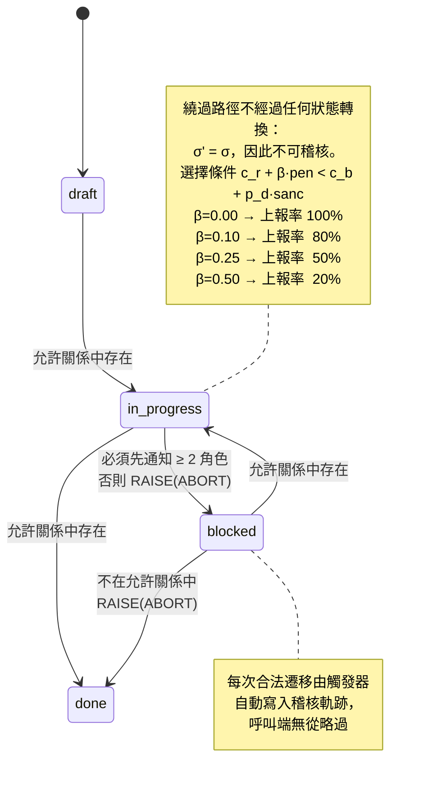

+++
title = "留痕優於自評：補償機制的可稽核性條件、阻力排序，與被指標化後的反轉點"
date = "2026-09-14T12:10:07+08:00"
author = "梅乾"
draft = false
isCJKLanguage = true
description = "剖析自我評估規則缺乏拒絕能力的困境，形式化推導可稽核狀態轉換的誘因相容不等式，並揭示將阻力訊號轉化為考核指標時機制必然發生的反轉與訊號蒸發。"
tags = [
    "分析論述", # term:AnalyticalEssay
    "大型語言模型", # term:LargeLanguageModel
    "機制設計", # term:MechanismDesign
    "可稽核性", # term:Auditability
    "誘因相容", # term:IncentiveCompatibility
    "指標反轉", # term:MetricInversion
    "狀態約束", # term:StateConstraint
    "確定性邊界", # term:DeterministicTrustBoundary
  ]
series = ["進不了控制迴路的量：研發治理中的可重複性前提、流動守恆與文字效力"]
[ai_info]
    [ai_info.generation]
        model = "Claude Opus 5"
        agent = "Claude Code VSCode Extension 2.1.270"
    [ai_info.refinement]
        model = "Gemini 3.8 Flash"
        agent = "Antigravity IDE 2.5.5"
+++

<!--more-->

## 導言

兩條規則並列在同一份流程文件裡，處理的是同一個問題。

第一條寫著：遇到規格上的問題請即時反映。第二條寫著：發現規格在技術上不可行、有矛盾、或遺漏關鍵場景時，嚴禁自行變通實作，必須將該工作項標記為受阻並通知構思端與流程端。

兩條的語氣強度差不多，第二條甚至略嚴。而它們的實際效果差距極大：第一條幾乎從未被援引，第二條每個月都在產生記錄。

直覺上的解釋是第二條寫得比較具體，所以比較好遵守。這個解釋不完整，因為它預測錯了一件事——如果只是具體度的差別，那麼把第一條改寫得更具體應該就能達到類似效果，而實務上把「請即時反映」改成「請在發現問題後的一個工作天內反映」並沒有改變任何事。

從這個結果回推，兩條規則真正的差別不在具體度，而在**它們要求的東西能不能被檢查**。第一條要求當事人評估自己的狀態——我這次遇到的算不算「規格上的問題」——而這個評估發生在一個人的腦中，沒有任何外部觀察者能夠驗證它是否發生過。第二條要求一個狀態轉換加上兩則通知，做了沒做，資料庫裡看得出來。

這個區分推出一個可以形式化的判準，而判準之後還有一個更麻煩的問題：第二條規則不是無條件穩固的。它有兩個可以讓它失效的條件，而其中一個特別隱蔽——**當上報的次數被拿來當成某個人的績效訊號時，這條機制會反轉，從一個浮現問題的管道變成一個必須避免觸發的東西。**

本文要建立的是這個機制的三個部分：**可稽核性**（Auditability） <!-- term:Auditability -->為什麼是必要條件、阻力排序為什麼是穩固條件、以及反轉點在哪裡。

> [!IMPORTANT]
> **可稽核性** <!-- term:Auditability --> (Auditability): 動作與狀態留下可供事後驗證之證據的性質。 <!-- anchor:Auditability -->


---

## 分析

### 可稽核性：規則所要求的東西必須留下狀態

先把「可檢查」寫成一個精確的性質，因為它是後面兩節的前提。

任何規則都可以被寫成「在條件 $c$ 下必須執行動作 $a$」。這條規則能不能被稽核，取決於 $a$ 執行之後系統的狀態是否改變，以及那個改變是否對第三方可見。

把動作分成兩類：

- **內在動作**：其結果只存在於執行者的認知中。「評估自己是否遇到了規格問題」「判斷這件事重不重要」「注意到某個風險」都屬此類。執行前後，系統狀態完全相同。
- **外在動作**：其結果改變了一個可被第三方讀取的狀態。「把工作項從 `in_progress` 改為 `blocked`」「向兩個角色發出通知」「在稽核表中新增一列」都屬此類。

判準因此可以寫成一個關於狀態轉換的條件。設系統狀態為 $\sigma$，動作為 $a$，若

$$
\sigma' = \mathrm{apply}(a, \sigma) = \sigma
$$

則該動作不可稽核，因為「執行了」與「沒執行」在觀測上不可分辨。要求內在動作的規則，其可被偵測的違反集合是空集。

這件事在經濟學上有一個更一般的處理。當委託方無法觀測到代理方的行動、只能觀測到結果時，契約能達到的效率有明確的上界，其形式化見 [Holmström，1979 / 《Moral Hazard and Observability》](https://doi.org/10.2307/3003320)。該文的核心結論對本文直接適用：**能被納入契約的只有可觀測的量；不可觀測的行動只能透過與它相關的可觀測訊號間接激勵。** 一條要求自我評估的規則連間接訊號都沒有，因此它在契約意義下是空的。

實務上把這條判準落地的方式，是讓合法的狀態轉換本身成為唯一的通路——也就是說，繞過留痕就無法完成狀態轉換。下面這段 SQL 把它寫成資料層的約束：狀態只能沿著允許關係遷移，進入受阻狀態前必須已通知兩個角色，而每一次合法遷移都由觸發器自動寫入稽核軌跡。作為對照，同一張表上有一個沒有任何約束的自我評估欄位。

程式透過 Node.js 內建的 SQLite 介面執行，不需要安裝任何外部套件。

```sql
-- 把「狀態轉換必須留痕」寫成資料層的不可繞過約束，而不是一條要人記得的規約。
PRAGMA foreign_keys = ON;

CREATE TABLE work_item (
  id              INTEGER PRIMARY KEY,
  state           TEXT NOT NULL CHECK (state IN ('draft','in_progress','blocked','done')),
  self_assessment TEXT                      -- 對照組：自我評估欄位，無任何約束
);

-- 合法的狀態轉移關係；不在此表內的轉移一律不存在
CREATE TABLE allowed_transition (
  from_state TEXT NOT NULL,
  to_state   TEXT NOT NULL,
  PRIMARY KEY (from_state, to_state)
);
INSERT INTO allowed_transition VALUES
  ('draft','in_progress'), ('in_progress','blocked'),
  ('in_progress','done'),  ('blocked','in_progress');

CREATE TABLE notification (
  item_id INTEGER NOT NULL REFERENCES work_item(id),
  role    TEXT NOT NULL,
  PRIMARY KEY (item_id, role)
);

-- 唯寫的稽核軌跡：每一次狀態轉移都在此留下一列
CREATE TABLE transition_log (
  seq        INTEGER PRIMARY KEY AUTOINCREMENT,
  item_id    INTEGER NOT NULL,
  from_state TEXT NOT NULL,
  to_state   TEXT NOT NULL
);

-- 閘門一：轉移必須在關係表內，否則中止
CREATE TRIGGER t_guard_transition BEFORE UPDATE OF state ON work_item
WHEN NOT EXISTS (SELECT 1 FROM allowed_transition
                 WHERE from_state = OLD.state AND to_state = NEW.state)
BEGIN
  SELECT RAISE(ABORT, 'illegal transition');
END;

-- 閘門二：進入 blocked 前，必須已通知至少兩個角色
CREATE TRIGGER t_guard_blocked BEFORE UPDATE OF state ON work_item
WHEN NEW.state = 'blocked'
 AND (SELECT COUNT(*) FROM notification WHERE item_id = NEW.id) < 2
BEGIN
  SELECT RAISE(ABORT, 'blocked requires notifying two roles');
END;

-- 痕跡不是選配：合法轉移一律自動寫入稽核軌跡
CREATE TRIGGER t_log_transition AFTER UPDATE OF state ON work_item
BEGIN
  INSERT INTO transition_log (item_id, from_state, to_state)
  VALUES (OLD.id, OLD.state, NEW.state);
END;

-- 誘因模型：個體在「上報」與「繞過」之間選擇低成本路徑。
--   U_report = c_r + beta * penalty      (beta>0 代表上報次數被當成負面指標)
--   U_bypass = c_b + p_detect * sanction (p_detect=0 代表沒有任何檢查會發現繞過)
CREATE TABLE actor (
  id INTEGER PRIMARY KEY, c_r REAL, c_b REAL, penalty REAL, p_detect REAL, sanction REAL
);

CREATE VIEW choice AS
SELECT id,
       c_r + :beta * penalty                AS u_report,
       c_b + p_detect * sanction            AS u_bypass,
       CASE WHEN c_r + :beta * penalty < c_b + p_detect * sanction
            THEN 'report' ELSE 'bypass' END AS action
FROM actor;
```

驅動腳本依序送入七個邊界輸入案例並比對結果。實際執行的輸出如下：

```text
邊界輸入案例                          結果
draft → in_progress（合法）            accepted
in_progress → blocked（未通知）         ABORT: blocked requires notifying two roles
補上兩個角色的通知                          accepted
in_progress → blocked（已通知）         accepted
blocked → done（關係表中不存在）            ABORT: illegal transition
blocked → in_progress（合法）          accepted
自我評估欄位寫入空字串                        accepted
自我評估欄位寫入任意宣稱                       accepted

稽核軌跡（由觸發器自動寫入，呼叫端無從略過）: draft→in_progress, in_progress→blocked, blocked→in_progress

beta（上報被當成負面指標的強度）→ 上報率
  beta=0.00  上報率 = 100%
  beta=0.10  上報率 = 80%
  beta=0.25  上報率 = 50%
  beta=0.50  上報率 = 20%

OK: 六項不變式全部通過
```

前六列構成一次完整的走查。第二列被拒絕，因為進入受阻狀態前尚未通知兩個角色；補上通知之後第四列被接受。第五列被拒絕，因為從受阻直接跳到完成不在允許關係中。**每一次拒絕都伴隨一個具體的理由字串，而每一次接受都自動產生一列稽核軌跡。**

最後兩列是對照組。自我評估欄位接受空字串，也接受任意宣稱，兩者都沒有引起任何反應。這一欄在形式上存在、在效力上為空——它的拒絕集合是空集，因此它不能承擔任何治理功能。

這裡需要就地釐清一個貫穿全文的前提：**確定性邊界（Deterministic Trust Boundary） <!-- term:DeterministicTrustBoundary --> vs 統計執行層**。確定性邊界 <!-- term:DeterministicTrustBoundary -->是指那些對同一輸入永遠給出同一判定、且判定結果具有拒絕力的機制——編譯器、型別檢查、資料庫約束、觸發器。統計執行層則是指以機率或判斷產生輸出、不保證對同一輸入給出同一結果、且預設不產生拒絕的機制——包括人的自我評估。兩者不可互換：把統計執行層放在原本由確定性邊界 <!-- term:DeterministicTrustBoundary -->把守的位置，該位置的拒絕集不是變小，而是直接歸為空集。

> [!IMPORTANT]
> **確定性邊界** <!-- term:DeterministicTrustBoundary --> (Deterministic Trust Boundary): 在系統設計中，劃分確定性執行層（如腳本、CI）與統計推論層（如大語言模型）的介面契約，以確保關鍵操作的 100% 正確性。 <!-- anchor:DeterministicTrustBoundary -->


**因果機制**：規則的約束力來自違反的後果，而後果的前提是違反可被偵測。動作不改變系統狀態時，違反與遵守在任何觀測下同構，因此偵測機率為零。

**邊界條件**：有些規則編碼的是真正需要判斷的事，而它們由一個會真的拒絕的人背書。那是人作為檢查點，不是沒有檢查點——該人的拒絕行為本身是一個外在動作，會留下狀態。判別方式是問：這條規則被違反時，有沒有任何人或任何東西會知道。

**反例**：一條要求「重大變更必須經過風險評估」而未定義何謂重大、也未要求任何產出的規則。每個人都真誠地認為自己評估過了，而該規則自建立以來沒有擋下任何一次變更。它的存在不是中性的——它佔據版面，並讓組織相信這個風險已經被處理。

### 阻力排序：可稽核是必要條件，不是充分條件

前一節建立了必要條件。這一節說明為什麼它不充分，因為一條可稽核的規則仍然可能被繞過。

考慮一個實作者面對規格問題時的選擇。它有兩個選項：上報（標記受阻並通知）或繞過（自行決定一個處理方式並繼續）。兩者各有成本：

$$
U_{\text{report}} = c_r + \beta\cdot \text{pen}, \qquad
U_{\text{bypass}} = c_b + p_d\cdot \text{sanc}
$$

其中 $c_r$ 是上報的直接成本——填表、解釋、等待回覆、被追問；$c_b$ 是繞過的直接成本——自己想出一個處理方式並承擔它；$p_d$ 是繞過被發現的機率，$\text{sanc}$ 是被發現時的代價；$\beta$ 是上報行為本身帶來的負面後果的權重，稍後會用到。

選擇上報的條件是 $U_{\text{report}} < U_{\text{bypass}}$，即

$$
c_r + \beta\cdot\text{pen} \;<\; c_b + p_d\cdot\text{sanc}
$$

先看 $\beta=0$ 的情況，也就是上報不帶來任何負面後果。此時條件簡化為 $c_r < c_b + p_d\cdot\text{sanc}$。

關鍵在 $p_d$。如果繞過從來不會被發現——而這正是「沒有檢查機制」的定義——則 $p_d=0$，條件變成

$$
c_r \;<\; c_b
$$

也就是說，**當繞過不會被偵測時，行為完全由兩條路徑的直接成本決定，與規則寫得多嚴無關。** 一條措辭極嚴的規則若其上報成本高於繞過成本，實際行為會往低阻力方向走，而且走的人不會覺得自己在違規——它會覺得自己在解決問題。

這解釋了為什麼開頭那兩條規則的差別不只在可稽核性 <!-- term:Auditability -->。第二條之所以有效，除了它可稽核之外，還因為它把上報做成了一個低成本動作：標記狀態加兩則通知，不需要寫理由、不需要開會、不需要說服任何人。若同一條規則要求「填寫受阻申請單並附上替代方案評估」，$c_r$ 會上升到繞過之上，而規則的措辭一個字都不用改。

**因果機制**：行為選擇由兩條路徑的期望成本差決定。規則的措辭不進入這個比較，除非它透過提高 $p_d$ 或 $\text{sanc}$ 改變其中一項。

**邊界條件**：當 $p_d$ 顯著大於零時——例如繞過的處理方式會在**程式碼審查**（Code Review） <!-- term:CodeReview -->中被看見——阻力排序的重要性下降，因為 $p_d\cdot\text{sanc}$ 這一項會撐住不等式。此時即使 $c_r$ 略高於 $c_b$，上報仍然是理性選擇。

> [!IMPORTANT]
> **程式碼審查** <!-- term:CodeReview --> (Code Review): 由團隊成員或自動化工具對新提交的原始碼進行品質、風格與邏輯檢查的審查程序。 <!-- anchor:CodeReview -->


**反例**：一個把受阻標記做成需要專案經理核准才能設定的欄位的系統。標記本身可稽核，而設定它需要先找到人、解釋情況、等待核准，因此 $c_r$ 遠高於「自己想個辦法繼續做」的 $c_b$。這個機制的可稽核性 <!-- term:Auditability -->完好，而它的觸發次數趨近於零。

### 反轉點：當讀數本身被賦予代價

前兩節的條件都滿足時，機制運作良好。這一節處理一個特別隱蔽的失效——它不來自**機制設計**（Mechanism Design） <!-- term:MechanismDesign -->的缺陷，而來自機制之外的一個決定。

> [!IMPORTANT]
> **機制設計** <!-- term:MechanismDesign --> (Mechanism Design): 博弈論的一個分支，研究如何設定規則與誘因結構，使得理性個體在追求自利時能達成系統期望的集體結果。 <!-- anchor:MechanismDesign -->


假設某位管理者注意到受阻標記的記錄很有用，於是把它納入團隊儀表板，並開始追蹤「每人每月的受阻次數」。追蹤本身是中性的，而一旦這個數字被解讀為負面訊號——受阻次數多代表這個人比較難搞、比較會卡關、比較不會自己解決問題——$\beta$ 就從零變成正數。

代入不等式：

$$
c_r + \beta\cdot\text{pen} \;<\; c_b + p_d\cdot\text{sanc}
$$

$\beta$ 上升使左端增大，因此原本滿足不等式的人會逐一翻轉到繞過那一側。翻轉的順序由各人的 $c_r$ 與 $c_b$ 決定：$c_b - c_r$ 差距最小的人最先翻轉。

上面的輸出最後一段給出這條翻轉曲線。同一群十個人，$\beta=0$ 時上報率是百分之百；$\beta=0.10$ 時降到百分之八十；$\beta=0.25$ 時剩百分之五十；$\beta=0.50$ 時只剩百分之二十。**機制沒有被撤銷，規則沒有被修改，文件一個字都沒動，而它的觸發率在四個參數點上單調崩塌。**

這個過程有一個令人不安的性質：它在數據上看起來像成功。受阻次數下降，儀表板上的紅色區塊變少，而管理者會合理地認為追蹤這個指標產生了正面效果。指標改善了，指標所代表的東西反向了。這類「一個量被用來做決策後就失去其原本意義」的現象，其分類與生成條件在 [Manheim 與 Garrabrant，2018 / 《Categorizing Variants of Goodhart's Law》](https://arxiv.org/abs/1803.04585) 中有系統的整理。

而機制設計 <!-- term:MechanismDesign -->的一般結論也指向同一處：一個機制要能持續誘出真實資訊，它必須讓說真話成為參與者的最佳策略，這個條件的形式化見 [Myerson，1979 / 《Incentive Compatibility and the Bargaining Problem》](https://doi.org/10.2307/1912346)。把上報次數當成負面指標，恰好違反了這個條件——它讓隱瞞成為最佳策略。

下圖把三個條件與反轉路徑畫在一起。



圖的左側註記是整篇的壓縮：合法路徑上的每一步都被約束與留痕，而繞過路徑完全不觸及狀態機，因此它在任何稽核視角下都不存在。

下表把三個條件逐一走過，呈現每個條件單獨失效時的最終處置。

| 邊界輸入案例 | 關鍵判定條件 / **不變式**（Invariant） <!-- term:Invariant --> | 狀態轉移 | 最終處置結果 |
| :--- | :--- | :--- | :--- |
| 規則要求「即時反映」 | 動作為內在；$\sigma'=\sigma$ | **無狀態**（Stateless） <!-- term:Stateless -->轉移 | 不可稽核，可偵測違反集為空集 |
| 規則要求「標記受阻並通知兩角色」 | 動作為外在；觸發器強制留痕 | `in_progress` → `blocked` | 可稽核；未通知時 `RAISE(ABORT)` |
| 從受阻直接跳到完成 | 不在允許關係表中 | 無狀態 <!-- term:Stateless -->轉移 | `ABORT: illegal transition` |
| 自我評估欄位寫入任意宣稱 | 欄位無任何約束 | 值被寫入 | 接受；該欄的拒絕集為空，不承擔治理功能 |
| 上報成本高於繞過成本，$p_d=0$ | $c_r > c_b$ | 行為轉向繞過 | 機制可稽核但不被觸發 |
| 上報次數被當成負面績效訊號 | $\beta: 0 \to 0.5$ | 上報率 $100\% \to 20\%$ | 機制反轉；指標改善而問題隱形 |
| 繞過會在程式碼審查 <!-- term:CodeReview -->中被看見 | $p_d > 0$ | $p_d\cdot\text{sanc}$ 撐住不等式 | 即使 $c_r$ 略高仍選擇上報 |

> [!IMPORTANT]
> **不變式** <!-- term:Invariant --> (Invariant): 系統在任何合法狀態下都必須成立的斷言，是把評估規則寫成可執行檢查的基本單位。 <!-- anchor:Invariant -->
> **無狀態** <!-- term:Stateless --> (Stateless): 不依賴任何中介追蹤檔、任務完成與否完全由輸出目錄的實體檔案決定的設計，帶來冪等性與韌性。 <!-- anchor:Stateless -->


下表則把幾種常見的表面現象與其底層病灶並置，用意是讓誤診在診斷階段就被攔下。

| 表面讀數 / 現象 | 底層機制病灶 | 舊代脆弱做法 | 新代嚴格工程防線 |
| :--- | :--- | :--- | :--- |
| 規則寫得很嚴而從未被援引 | 動作為內在，$\sigma'=\sigma$，不可稽核 | 重申規則、提高語氣強度 | 把要求改寫成狀態轉換＋通知，由資料層強制 |
| 機制可稽核但觸發次數趨近於零 | $c_r > c_b$ 且 $p_d = 0$ | 宣導遵守、追究個案 | 削減上報的直接成本，或建立使 $p_d>0$ 的檢查 |
| 受阻次數下降，儀表板轉綠 | $\beta>0$ 使**誘因相容**（Incentive Compatibility） <!-- term:IncentiveCompatibility -->條件失效 | 認為追蹤指標奏效，繼續追蹤 | 把該讀數移出個人績效視圖，只保留於流程診斷 |
| 自我評估欄位填得很完整 | 該欄拒絕集為空，不攜帶資訊 | 要求填得更詳細 | 或改為有約束的結構化欄位，或明確標示為非治理欄位 |
| 繞過的處理方式事後才被發現 | 繞過路徑不觸及狀態機 | 事後檢討為何沒有早期預警 | 讓繞過也必須經過某個留痕點，把 $p_d$ 從 0 抬起來 |

> [!IMPORTANT]
> **誘因相容** <!-- term:IncentiveCompatibility --> (Incentive Compatibility): 機制設計中的關鍵性質，要求參與者誠實揭露資訊或遵守規則的預期效益高於隱瞞或違規的預期效益。 <!-- anchor:IncentiveCompatibility -->


**因果機制**：$\beta$ 進入選擇不等式的左端，因此它上升時滿足不等式的個體比例單調下降。翻轉是連續的而非突變的，這使它在觀測上呈現為「情況逐漸好轉」。

**邊界條件**：若上報的次數同時被賦予正面價值——例如它被計入「主動發現問題」的貢獻——則 $\beta$ 可能為負，此時機制會被過度觸發，產生另一種扭曲。兩個方向都要避免，正確的位置是把這個讀數完全移出個人評價。

**反例**：一個把「受阻解除的平均時間」作為構思端績效指標的組織。這個設計方向看起來對——它獎勵快速回應——而它的副作用是構思端傾向把難以回答的受阻項標記為「已解除、請實作端自行判斷」。指標所量的東西被移轉到另一個沒有指標的地方。

---

## 反思

本文的三個條件有一個共同的形狀：它們都把一個關於態度的問題改寫成一個關於結構的問題。規則為什麼沒被遵守，這個問題的常見答案是紀律、意識或文化，而三個條件給出的答案分別是狀態不變、成本排序與誘因權重。三者都可以被直接調整，而態度不行。

這帶出一個實務上的次序。面對一條不被遵守的規則時，先問它要求的動作會不會改變任何可觀測狀態；答案是否定的就先改寫動作，此時不必討論任何別的事。動作改寫完成後，再量一次兩條路徑的直接成本，確認上報確實比繞過省事。**只有在這兩件事都做完之後，剩下的部分才可能是態度問題**，而根據經驗，剩下的部分通常很小。

第二個反思關於那個反轉。它特別值得記住，因為它是一個**由善意動作觸發的失效**。把受阻記錄納入儀表板是一個合理的管理動作——這些記錄確實有用，確實應該被看見。問題不在看見，在於看見的方式：同一份資料放在「流程診斷」的視圖裡是中性的，放在「個人績效」的視圖裡就變成了 $\beta>0$。**資料本身不決定 $\beta$，資料的擺放位置決定 $\beta$。**

這推出一條可以直接執行的設計規則：任何用來浮現問題的讀數，都必須在設計時明確聲明它不進入個人評價，並且這個聲明必須有結構上的保障——例如該欄位在個人視圖中根本不可見，而不只是寫在使用說明裡。一個依賴管理者自律的保障，其拒絕集同樣是空的。

第三件值得記下的事關於這套機制的一個內在張力。可稽核性 <!-- term:Auditability -->要求留痕，而留痕本身會製造一個可被追蹤的數字，而可被追蹤的數字遲早會被某個人拿去做某種比較。也就是說，**使機制有效的那個性質，同時是使它可能被反轉的那個性質。** 這不是一個可以被消除的張力，只能被管理——透過明確的欄位**可見性**（Visibility） <!-- term:Visibility -->設計，以及在引入任何新的追蹤視圖時重新檢查 $\beta$。

> [!IMPORTANT]
> **可見性** <!-- term:Visibility --> (Visibility): 知識在開發團隊或 AI 代理人之間的公開與可存取程度。 <!-- anchor:Visibility -->


最後一個觀察關於範圍。本文所有的分析都假設繞過是一個個體決策，而實際上它經常是一個被默許的集體慣例。當一個團隊裡多數人都在繞過時，$c_b$ 會進一步下降——因為繞過不再需要承擔「只有我這樣做」的心理成本——而 $c_r$ 會上升，因為上報變成一個偏離群體的動作。這個社會性的回饋會放大原本的成本差距，使得一旦系統滑到繞過那一側，把它推回來需要的不只是恢復原本的參數。

---

## 實務對比

**其一：規則所要求的動作形式**

錯誤的作法是寫「遇到問題請即時反映」「重大變更必須經過評估」「有疑慮時應主動確認」。三者都要求當事人評估自己的狀態，而該評估發生在腦中，執行前後系統狀態相同，因此可偵測的違反集合是空集。

正確的作法是把要求改寫成一個狀態轉換加上一個通知，並讓資料層強制它——不合法的轉移被拒絕，合法的轉移自動留痕。判準是：這條規則被違反時，資料庫裡有沒有任何一列會不同。沒有，它就不是規則，是期望。

**其二：上報路徑的成本**

錯誤的作法是把上報做成一道需要核准、需要填寫理由、需要附上替代方案的流程，理由是這樣可以避免濫用。這個設計把上報成本推高到繞過之上，而在繞過不被偵測的前提下，行為會完全依成本排序。

正確的作法是讓上報成為整條路徑上最省事的動作——一次狀態切換、一個自動通知、零額外文件——並把補充資訊的要求移到上報之後。判準是：一個趕時間的人，是上報比較快還是自己想辦法比較快。後者比較快時，規則的措辭寫得再嚴也不會改變行為。

**其三：浮現用讀數的擺放位置**

錯誤的作法是把受阻次數、回報次數、發現問題的次數放進個人或團隊的績效視圖，即使意圖是正面的。這些讀數一旦與評價關聯，$\beta$ 就從零變正，而上報率會單調下降至個位數百分比。

正確的作法是讓這類讀數只存在於流程診斷的視圖裡，並在結構上保證它不出現在個人視圖中——不是靠說明文件約定，是靠欄位權限。判準是：這個數字上升時，有沒有任何一個人會因此在某次評價中處境變差。有，這個機制的反轉已經開始了，而它會表現為指標好轉。

---

## 結論

一條規則的效力取決於它所要求的動作是否改變可觀測狀態，以及遵守它是否比繞過它更省事。

由此得到三個可遷移的判斷。第一，要求內在動作的規則在契約意義下是空的：執行與未執行在任何觀測下同構，因此它可偵測的違反集合是空集，而把它寫得更具體不改變這一點；把要求改寫成狀態轉換加通知，並由資料層強制合法遷移與自動留痕，是唯一能改變這個性質的動作。第二，可稽核是必要條件而非充分條件——當繞過的偵測機率為零時，行為完全由兩條路徑的直接成本決定，因此一條措辭極嚴而上報成本偏高的規則，其觸發次數會趨近於零，且違規者不會認為自己在違規。第三，讓機制有效的那個留痕性質，同時使它可能被反轉：一旦留下的次數被賦予負面價值，滿足誘因相容 <!-- term:IncentiveCompatibility -->條件的個體比例單調下降，而這個崩塌在觀測上呈現為指標好轉。

寫下一條規則之前，先回答兩個問題：違反它的時候，哪一列資料會不同；遵守它的時候，是不是比不遵守更省事。兩題都答不出來時，這條規則的作用是佔版面，不是約束行為。