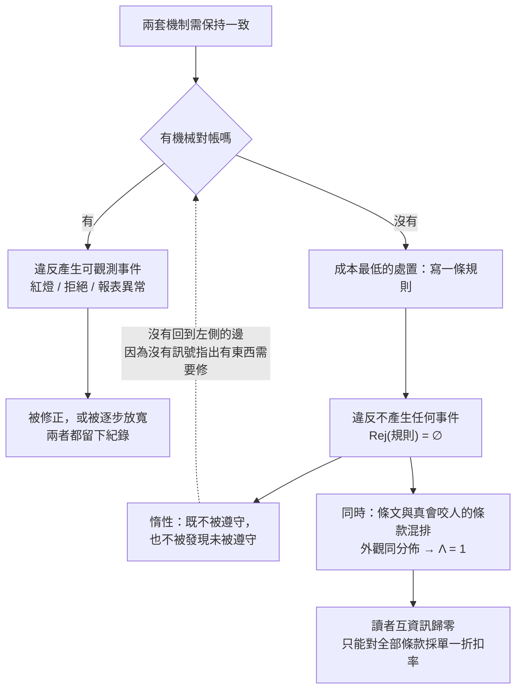

+++
title = "規則書作為缺口地圖：惰性條文的析出、三種零效力，與混排下的單一折扣率"
date = "2026-09-14T12:40:08+08:00"
author = "梅乾"
draft = false
isCJKLanguage = true
description = "結合訊號賽局與貝氏推論，證明無檢查機制之惰性條文與剛性約束混排時似然比為一，促使理性讀者陷入 Pooling 均衡並採取單一折扣率，提出按接縫位置診斷機制缺口之方法。"
tags = [
    "分析論述", # term:AnalyticalEssay
    "治理診斷", # term:GovernanceDiagnostics
    "規則效力", # term:RuleEfficacy
    "訊號賽局", # term:SignalingGame
    "可區分性", # term:Distinguishability
    "似然比", # term:LikelihoodRatio
    "互資訊", # term:MutualInformation
    "可觀測性", # term:Observability
  ]
series = ["進不了控制迴路的量：研發治理中的可重複性前提、流動守恆與文字效力"]
[ai_info]
    [ai_info.generation]
        model = "Claude Opus 5"
        agent = "Claude Code VSCode Extension 2.1.270"
    [ai_info.refinement]
        model = "Gemini 3.8 Flash"
        agent = "Antigravity IDE 2.5.5"
+++

<!--more-->

## 導言

一份工程規範裡寫著：所有公開介面的變更必須附帶回溯相容性評估。

這條規則有編號、有粗體的「必須」、放在一個叫做「強制要求」的章節底下。而沒有任何工具在檢查它，沒有任何流程節點會因為它被略過而停下來，也沒有任何人在合併變更之前確認那份評估存在。它從來不曾產生一次可觀測的違反——沒有紅燈、沒有報表、沒有被擋下的提交。

這類條文的常見處置是歸類為冗餘：規則太多、該精簡。這個處置的問題在於它預測錯了後續。如果只是冗餘，刪掉它應該讓文件變乾淨而不損失任何東西；而實際上刪掉之後，那個原本需要回溯相容性評估的地方仍然沒有任何東西在守，只是現在連一個標記都沒有了。

從這個結果回推，值得問的不是「該不該刪」，而是**這條規則當初是怎麼長出來的**。它不是憑空出現的。某個時刻有人發現兩件事必須保持一致——已發布的介面與新的變更——而當時沒有任何機制在機械地比對它們。在那個位置上，組織做了一件成本最低的事：寫一條規則。

這個視角把規則書從一份待精簡的清單改寫成一張地圖。**每一條沒有檢查的強制條款，都標記著組織架構裡一道缺少對帳機制的接縫。** 而這張地圖還有第二層——當這些條文與真正會咬人的條文用同樣的編號、同樣的助動詞、同樣的版面混排在一起時，讀者會發生什麼事。第二層的答案是可以被算出來的，而它推翻了關於「規則太多」的標準解釋。

---

## 分析

### 析出：條文從哪裡長出來

先確立這類條文的來源，因為來源決定了為什麼刪除它治不好。

當兩套機制必須保持一致，而沒有任何東西機械地比對它們時，組織面對一個選擇。它可以建立一個對帳機制——寫一個檢查器、加一道閘門、設一個約束——或者寫一條規則。後者的即時成本遠低於前者，而兩者在會議紀錄上看起來同樣像是一個處置。

於是規則出現在接縫上。觀察一份流程文件裡強制條款的分佈，會發現它們並非均勻散佈，而是聚集在特定的位置：

- 票要進入測試狀態之前，任務清單必須全部勾選——補一道**系統邊界**上缺的對帳，因為票務系統與任務清單是兩套各自獨立的狀態。
- 嚴禁實作者自行變通繞過規格——補一道**角色邊界**上缺的對帳，因為構思端與實作端之間沒有機械比對。
- 簽核前必須比對原始目標——補一道**層級深度**造成的回饋缺口，因為決策與後果之間隔了太多層。

三條規則處理的問題完全不同，而三條都出現在「兩套東西必須一致而沒人在比對」的位置。**接縫愈多，這類條文愈多**，這不是巧合，是同一個生成機制的結果。

下圖把兩條路徑並排，重點在於說明其中一條為何無法自我修正。



圖的右半沒有任何一條邊回到判斷節點。這不是因為沒有人想修，而是**沒有訊號指出有東西需要修**——一條從未被違反過的規則，在任何報表上都表現得像一條被完美遵守的規則。

**因果機制**：規則的約束力來自違反的後果，而後果的前提是違反可被偵測。偵測缺席時，規則的語氣強度與它的實際效力完全**脫鉤**（Desynchronization） <!-- term:Desynchronization -->——一條用「必須」寫的條款與一條用「建議」寫的條款，在拒絕集合上都是空集。

> [!IMPORTANT]
> **脫鉤** <!-- term:Desynchronization --> (Desynchronization): 中介索引檔與真實檔案系統狀態不再一致的現象，是雙重狀態同步最典型的故障表現。 <!-- anchor:Desynchronization -->


**邊界條件**：並非所有未自動化的規則都屬此類。有些規則編碼的是真正需要判斷的事，而它們由一個會真的拒絕的人背書——那是人作為檢查點，不是沒有檢查點。判別方式是問：這條規則被違反時，有沒有任何人或任何東西會知道。

**反例**：一個在事故檢討後新增「今後所有配置變更必須經過雙人確認」的組織。這個動作成本低、看起來負責、會被記錄為改善措施，而它沒有指定由誰確認、沒有留痕的欄位、沒有任何節點會檢查它發生過。同一類事故在十四個月後重演，而檢討會議的結論是「規則已經有了，執行面需要加強」。

### 三種零效力：缺席、移除、死亡

一條規則的拒絕集為空，有三個來源，而它們的可偵測性與正確處置完全不同。混淆它們會導致把處方用在錯的對象上。

**第一種是移除。** 某個檢查曾經存在，後來被拿掉了。這是一個事件：它在版本歷史上留下一筆差異、可能在會議上被討論、可能有人反對。用資訊論的語言說，移除產生了一個可觀測符號，其自訊息量 $-\log_2 P(\text{移除})$ 為正值。

**第二種是死亡。** 某個機制建立時有真實的作用，而它所治理的對象消失了。它仍在運轉、仍然通過、仍然產生紀錄，只是它守的東西已經不存在。它的拒絕集合非空但無意義。

**第三種是缺席。** 條文從撰寫的那一刻起就沒有接上任何檢查。它不是一個事件，而是某件事一直沒有發生。**缺席的自訊息量為零：它不產生任何可被觀測的符號。**

這三者的區分推出一條重要的否定結論：**流程稽核偵測不到缺席。** 稽核檢查的是流程有沒有被執行，而缺席的檢查通常伴隨著被完整執行的流程——文件產出了、審查召開了、簽核完成了，而沒有任何一步會因產物違規而拒絕它。

還有一種相鄰的混淆需要排除。有一類研究處理的是「反覆觀察到異常卻沒有後果，於是異常逐步被重新定義為可接受」——這個過程需要兩個前提：一個可觀測的異常，以及重複觀察到它卻存活下來。太空梭固體火箭推進器接頭的侵蝕數據就是這樣一個案例，它被量測、被記錄、被討論，而飛行照常進行；相關的技術分析與決策過程記載於 [NASA，1986 / 《Report of the Presidential Commission on the Space Shuttle Challenger Accident》](https://history.nasa.gov/rogersrep/genindex.htm)。

那個機制無法解釋缺席，因為缺席的情況下沒有異常事件可供重新定義——沒有數據、沒有被看見的東西、沒有需要被重新解釋的偏差。**把缺席當成那個機制來治，得到的答案會是「沒有異常」，而那個答案是對的，只是毫無意義。**

處置也因此不同。死掉的機制該退役：確認風險場景不再可能發生，提取可遷移的片段，然後移除。缺席的條文不能只是移除，因為它佔據的那道接縫仍然存在——**要嘛補上機制，要嘛承認那道接縫是空的並停止假裝它被守著。**

能夠偵測缺席的手段必須是主動的：對已知合法的產物注入變異，觀察是否有任何檢查拒絕它。存活的變異體就是該類違規沒有任何東西在守的直接證據。這個做法把缺席從不可觀測的零訊息狀態，轉換成一個可觀測的存活計數，因而使它進得了稽核。

**因果機制**：三者與被治理對象的關係不同——移除失去了檢查、死亡失去了對象、缺席從未擁有任何一個。關係不同因此**可觀測性**（Observability） <!-- term:Observability -->不同，可觀測性 <!-- term:Observability -->不同因此偵測手段不同。

> [!IMPORTANT]
> **可觀測性** <!-- term:Observability --> (Observability): 軟體系統或程式邏輯的運作狀態被外部工具或監控機制感知、偵測與度量的難易程度。 <!-- anchor:Observability -->


**邊界條件**：同一條規則可以先後是兩者。曾經有檢查、檢查被移除、條文留下——這種情況按缺席處理，因為當下的狀態是無檢查，而處置取決於當下狀態而非歷史。

**反例**：一個把所有沒有工具檢查的條款逕行刪除、並宣告規則書「已完成精簡」的團隊。文件確實變短了，而每一道原本被標記出來的接縫現在既沒有機制也沒有標記。六個月後其中兩道接縫各出了一次事故，而事故檢討找不到任何線索指向「這裡本來就沒有對帳」。

### 混排：為什麼處方是可區分性而不是減量

前兩節處理條文本身。這一節處理讀者，而這裡有一個被廣泛誤診的機制。

未執行的規則會損害其他規則的可信度，這件事本身不新。常見的解釋是**容量論證**：規則太多導致心力耗損、注意力超載，因此不遵守。容量論證推出的處方是減量。

容量論證在這裡是錯的，而它錯得可以被證明。**一個精神飽滿、動機充足、注意力無限的讀者，仍然會對全部條款套用同一個折扣率（Discount Factor） <!-- term:DiscountFactor -->**，因為它分不出哪些會咬人。這是一個關於資訊的論證，不是關於容量的論證。

> [!IMPORTANT]
> **折扣率** <!-- term:DiscountFactor --> (Discount Factor): 理性讀者在面對可能失效或缺乏強制的文字條款時，在事前評估與執行投入上所打折的心理折現比例。 <!-- anchor:DiscountFactor -->


形式化很直接。設條款的效力為隱藏變數 $E\in\{\text{會咬人},\text{惰性}\}$，先驗機率 $\pi=P(E=\text{會咬人})$；讀者觀測到的是條款的外觀 $X$——編號格式、助動詞強度、所在章節。**似然比**（Likelihood Ratio） <!-- term:LikelihoodRatio -->為

> [!IMPORTANT]
> **似然比** <!-- term:LikelihoodRatio --> (Likelihood Ratio): 在特定假設成立與不成立下觀測到同一徵候的條件機率之比，決定貝氏後驗更新的幅度。 <!-- anchor:LikelihoodRatio -->


$$
\Lambda(x) \;=\; \frac{P(X=x \mid E=\text{會咬人})}{P(X=x \mid E=\text{惰性})}
$$

當兩類條款的外觀分佈相同時 $\Lambda\equiv 1$，於是貝氏後驗

$$
P(E=\text{會咬人}\mid X=x) \;=\; \frac{\pi\Lambda(x)}{\pi\Lambda(x) + (1-\pi)} \;=\; \pi
$$

**後驗等於先驗，觀測沒有提供任何資訊。** 等價地說，外觀與效力之間的**互資訊**（Mutual Information） <!-- term:MutualInformation --> $I(X;E)=0$。這是一個訊號完全失效的均衡，其原型是品質不可分辨的市場中好貨與壞貨按同一價格成交的情況，見 [Akerlof，1970 / 《The Market for "Lemons": Quality Uncertainty and the Market Mechanism》](https://doi.org/10.2307/1879431)；而使訊號重新攜帶資訊的條件——發送者必須付出與其類型相關的差別成本——見 [Spence，1973 / 《Job Market Signaling》](https://doi.org/10.2307/1882010)。互資訊 <!-- term:MutualInformation -->的定義與其為零的條件則出自 [Shannon，1948 / 《A Mathematical Theory of Communication》](https://doi.org/10.1002/j.1538-7305.1948.tb01338.x)。

> [!IMPORTANT]
> **互資訊** <!-- term:MutualInformation --> (Mutual Information): 兩個隨機變數之間共享的資訊量，用來量化潛在變數是否攜帶輸入資訊。 <!-- anchor:MutualInformation -->


現在來到關鍵之處。容量論證與資訊論證對同一組干預給出**不同的預測**，因此它們可以被實驗區分：

- 容量論證預測：**減少條款數量會改善遵守程度**，因為注意力負擔下降。
- 資訊論證預測：**在混合比例不變的前提下減量完全無效**，而在數量不變的前提下分區完全有效。

下面這段程式把四種干預跑過一遍，並計算每種情況下讀者的後驗折扣率 <!-- term:DiscountFactor -->、互資訊 <!-- term:MutualInformation -->與注意力誤配損失。只用 Node.js 標準函式庫。

```javascript
// 混排使條款的外觀不攜帶效力資訊：理性讀者只能採單一折扣率，且該折扣率與條款數量無關。
import assert from 'node:assert/strict';

const H = (p) => (p <= 0 || p >= 1 ? 0 : -(p * Math.log2(p) + (1 - p) * Math.log2(1 - p)));

/** 讀者的貝氏後驗：看到外觀 x 之後，「這條會咬人」的機率。
 *  pi   先驗（會咬人的條款佔比）
 *  lik  { enforced: P(x|會咬人), inert: P(x|不會咬人) } */
function posterior(pi, lik) {
  const num = pi * lik.enforced;
  const den = num + (1 - pi) * lik.inert;
  return den === 0 ? pi : num / den;
}

/** 外觀與效力之間的互資訊 I(X;E)，單位 bit。 */
function mutualInformation(pi, pFormalGivenE, pFormalGivenI) {
  const joint = [
    [pi * pFormalGivenE, pi * (1 - pFormalGivenE)],
    [(1 - pi) * pFormalGivenI, (1 - pi) * (1 - pFormalGivenI)],
  ];
  const px = [joint[0][0] + joint[1][0], joint[0][1] + joint[1][1]];
  const pe = [pi, 1 - pi];
  let I = 0;
  for (let e = 0; e < 2; e++)
    for (let x = 0; x < 2; x++) {
      const p = joint[e][x];
      if (p > 0) I += p * Math.log2(p / (pe[e] * px[x]));
    }
  return I;
}

const PI = 0.05;                     // 一百條裡有五條真的會擋下建置
const regimes = {
  '完全混排（統一編號、統一助動詞）': { e: 0.90, i: 0.90 },
  '弱標記（僅措辭略有不同）':          { e: 0.90, i: 0.70 },
  '完全分區（會咬人的獨立呈現）':      { e: 1.00, i: 0.00 },
};

console.log('版面制度'.padEnd(34), 'Λ'.padStart(8), '後驗 P(會咬人|外觀)'.padStart(20), 'I(X;E) bits'.padStart(14));
const out = {};
for (const [name, { e, i }] of Object.entries(regimes)) {
  const lam = i === 0 ? Infinity : e / i;
  const post = posterior(PI, { enforced: e, inert: i });
  const mi = mutualInformation(PI, e, i);
  out[name] = { lam, post, mi };
  console.log(name.padEnd(30), (lam === Infinity ? '∞' : lam.toFixed(3)).padStart(10),
    post.toFixed(4).padStart(21), mi.toFixed(6).padStart(15));
}
console.log(`\n先驗熵 H(π=${PI}) = ${H(PI).toFixed(6)} bits（完全分區時互資訊必須等於它）`);

// 可證偽判別：容量假說預測「減量改善」，資訊假說預測「只有混合比或可區分性改變才有效」
const MIX = regimes['完全混排（統一編號、統一助動詞）'];
const SEP = regimes['完全分區（會咬人的獨立呈現）'];
console.log('\n干預'.padEnd(32), '條款總數'.padStart(10), '會咬人佔比'.padStart(12), '讀者折扣率'.padStart(12));
const trials = [
  ['A 基準：100 條混排',              100, 0.05,  MIX],
  ['B 等比例減量至 50 條',             50, 0.05,  MIX],
  ['C 只刪惰性條款，剩 52 條',          52, 5 / 52, MIX],
  ['D 分區：條款數不變，版面分開',       100, 0.05,  SEP],
];
const disc = {};
for (const [label, n, pi, lik] of trials) {
  const d = posterior(pi, { enforced: lik.e, inert: lik.i });
  disc[label] = { n, pi, d, lik };
  console.log(label.padEnd(28), String(n).padStart(12), pi.toFixed(4).padStart(14), d.toFixed(4).padStart(14));
}

/** 注意力誤配損失：讀者對每個外觀群組投入該群組的後驗份額，錯配即為損失。 */
function misallocation(n, pi, lik) {
  let loss = 0;
  for (const [pxE, pxI] of [[lik.e, lik.i], [1 - lik.e, 1 - lik.i]]) {
    const pe = pi * pxE, pinert = (1 - pi) * pxI, den = pe + pinert;
    if (den === 0) continue;
    const d = pe / den;
    loss += n * (pe * (1 - d) + pinert * d);
  }
  return loss;
}
console.log('\n注意力誤配損失（條．單位）');
for (const [label, { n, pi, lik }] of Object.entries(disc))
  console.log('  ' + label.padEnd(28), misallocation(n, pi, lik).toFixed(3).padStart(8));

assert.ok(Math.abs(out['完全混排（統一編號、統一助動詞）'].lam - 1) < 1e-12, '混排下似然比必須恰為 1');
assert.ok(out['完全混排（統一編號、統一助動詞）'].mi < 1e-12, '混排下互資訊必須為零');
assert.ok(Math.abs(out['完全混排（統一編號、統一助動詞）'].post - PI) < 1e-12, '互資訊為零時後驗必須等於先驗');
assert.ok(Math.abs(out['完全分區（會咬人的獨立呈現）'].mi - H(PI)) < 1e-12, '完全分區時互資訊必須等於先驗熵');
assert.equal(disc['A 基準：100 條混排'].d, disc['B 等比例減量至 50 條'].d,
  '混合比不變時，單純減量對折扣率完全無效——容量假說在此被否證');
assert.ok(disc['C 只刪惰性條款，剩 52 條'].d > 1.9 * disc['A 基準：100 條混排'].d,
  '改變混合比才會動到折扣率');
assert.equal(disc['D 分區：條款數不變，版面分開'].d, 1.0,
  '條款數與混合比皆不變下，只有分區能把折扣率拉到確定');
assert.ok(misallocation(100, 0.05, SEP) < 1e-9, '完全分區時誤配損失必須歸零');
assert.ok(Math.abs(misallocation(100, 0.05, MIX) - 2 * misallocation(50, 0.05, MIX)) < 1e-9,
  '混排下誤配損失與條款數成正比，人均折扣率卻紋風不動');
console.log('\nOK: 九項不變式全部通過');
```

實際執行的輸出如下：

```text
版面制度                                      Λ         後驗 P(會咬人|外觀)    I(X;E) bits
完全混排（統一編號、統一助動詞）                    1.000                0.0500        0.000000
弱標記（僅措辭略有不同）                        1.286                0.0634        0.008045
完全分區（會咬人的獨立呈現）                          ∞                1.0000        0.286397

先驗熵 H(π=0.05) = 0.286397 bits（完全分區時互資訊必須等於它）

干預                                    條款總數        會咬人佔比        讀者折扣率
A 基準：100 條混排                          100         0.0500         0.0500
B 等比例減量至 50 條                          50         0.0500         0.0500
C 只刪惰性條款，剩 52 條                        52         0.0962         0.0962
D 分區：條款數不變，版面分開                       100         0.0500         1.0000

注意力誤配損失（條．單位）
  A 基準：100 條混排                    9.500
  B 等比例減量至 50 條                   4.750
  C 只刪惰性條款，剩 52 條                 9.038
  D 分區：條款數不變，版面分開                 0.000

OK: 九項不變式全部通過
```

第一段確認了機制本身。完全混排時似然比 <!-- term:LikelihoodRatio -->恰為 $1.000$，互資訊 <!-- term:MutualInformation --> $0.000000$ bits，後驗 $0.0500$ 等於先驗。完全分區時互資訊 <!-- term:MutualInformation -->達到 $0.286397$ bits，**恰好等於先驗熵 $H(\pi)$**——也就是說，分區把關於效力的**不確定性**（Uncertainty） <!-- term:Uncertainty -->完全消除了。中間那一列則說明弱標記的效果有限：措辭略有不同使似然比 <!-- term:LikelihoodRatio -->升到 $1.286$，而互資訊 <!-- term:MutualInformation -->只有 $0.008045$ bits，後驗從 $0.0500$ 只挪到 $0.0634$。

> [!IMPORTANT]
> **不確定性** <!-- term:Uncertainty --> (Uncertainty): 估計值因抽樣與執行變異而帶有的波動範圍，是判定分數差異是否顯著的前提。 <!-- anchor:Uncertainty -->


第二段是那個可證偽的判別。干預 A 與干預 B 的差別是條款總數從 100 降到 50，而混合比例維持 $0.05$；兩者的讀者折扣率 <!-- term:DiscountFactor -->都是 $0.0500$，**逐位元相同**。減量在混合比不變的前提下對折扣率 <!-- term:DiscountFactor -->沒有任何影響，容量論證在這個對照上被否證。

干預 C 則揭示了減量有時看起來有效的真正原因。只刪惰性條款、剩 52 條時，會咬人的佔比從 $0.05$ 升到 $0.0962$，折扣率 <!-- term:DiscountFactor -->同步升到 $0.0962$。**動的是混合比，不是數量**——而執行者通常把這次改善歸功於「規則變少了」。

干預 D 是對照的另一端。條款總數與混合比都沒有改變，只把會咬人的條款在版面上獨立呈現，折扣率 <!-- term:DiscountFactor -->從 $0.0500$ 跳到 $1.0000$。

第三段給出注意力誤配損失。混排 100 條的損失是 $9.500$，而分區 100 條的損失是 $0.000$——完全歸零。同時值得注意的是，等比例減量到 50 條把損失減半到 $4.750$，這正是容量論證會觀察到的「改善」；而它的來源只是條款總數變少，每一條的誤配程度完全沒有改變。

下表把這四種干預與它們各自的判定條件走一遍。

| 邊界輸入案例 | 關鍵判定條件 / **不變式**（Invariant） <!-- term:Invariant --> | 狀態轉移 | 最終處置結果 |
| :--- | :--- | :--- | :--- |
| 100 條混排，$\pi=0.05$ | $\Lambda=1 \Rightarrow I(X;E)=0$ | 後驗 $=$ 先驗 | 折扣率 <!-- term:DiscountFactor --> $0.0500$；誤配損失 $9.500$ |
| 等比例減量至 50 條 | $\pi$ 不變，$\Lambda$ 不變 | 無轉移 | 折扣率 <!-- term:DiscountFactor -->仍為 $0.0500$；容量論證被否證 |
| 只刪惰性條款，剩 52 條 | $\pi:0.05\to 0.0962$ | 先驗上移 | 折扣率 <!-- term:DiscountFactor --> $0.0962$；有效，但原因是混合比 |
| 分區，條款數與 $\pi$ 皆不變 | $\Lambda\to\infty$，$I(X;E)=H(\pi)$ | 後驗分裂為 $1$ 與 $0$ | 折扣率 <!-- term:DiscountFactor --> $1.0000$；誤配損失歸零 |
| 弱標記，僅措辭略有不同 | $\Lambda=1.286$ | 後驗 $0.0500\to 0.0634$ | 幾乎無效；標記必須夠強才改變分佈 |

> [!IMPORTANT]
> **不變式** <!-- term:Invariant --> (Invariant): 系統在任何合法狀態下都必須成立的斷言，是把評估規則寫成可執行檢查的基本單位。 <!-- anchor:Invariant -->


下表把幾種表面現象與其底層病灶並置，用意是讓誤診在診斷階段就被攔下。

| 表面讀數 / 現象 | 底層結構病灶 | 舊代脆弱做法 | 新代嚴格工程防線 |
| :--- | :--- | :--- | :--- |
| 治理文件一版比一版嚴謹而約束力未升 | 條文補的是缺席的機制，而更好的規則仍不是機制 | 再改寫一次措辭，提高助動詞強度 | 逐條追問守哪道接縫，能對帳的改寫成檢查器 |
| 稽核全部通過而同類事故重演 | 流程稽核查的是流程有沒有跑，缺席的自訊息量為零 | 增加稽核頻率與覆蓋範圍 | 對合法產物注入變異，以存活變異體計數為效力讀數 |
| 團隊反覆違反一條重要規則 | 混排使 $\Lambda=1$，讀者只能採單一折扣率 <!-- term:DiscountFactor --> | 歸因為輕忽，加強宣導與懲處 | 把會擋下建置的條款在版面上獨立呈現 |
| 刪減條款後遵守程度改善 | 動的是混合比 $\pi$，不是條款數量 | 把改善歸功於「規則變少」並持續減量 | 分開記錄 $\pi$ 與總數，確認是哪一個在動 |
| 終端關卡每次都出具通過報告 | 判定依賴判斷與抽樣，攔住了什麼無法從紀錄得知 | 以通過率作為品質證據 | 把可判定的部分前移為確定性閘門，關卡只留真需判斷者 |

這推出一條可以直接執行的處方：**讓約束與期望在外觀上不可混淆。** 而它同時排除了一種誤用——並不是所有未檢查的陳述都該刪。有些陳述的功能本來就不是約束，而是宣告方向：價值觀、設計哲學、我們希望成為什麼樣的團隊。這些有真實的作用，而且它們**不應該有機器檢查**。問題不在它們存在，在於它們與強制條款用同樣的助動詞、同樣的編號、同樣的版面呈現。

因此處方的精確形式不是「刪掉沒有檢查的規則」，而是三分流：會咬人的移到可被辨識的位置或直接移進檢查器的設定檔；屬於期望的明確標示為期望；既不是約束也不是期望、不守任何邊界的那一類，才刪。

**因果機制**：兩類外觀相同的物件無法被貝氏更新區分，因此理性讀者只能採用先驗作為後驗。這個後驗是混合比例的函數，與物件總數無關。

**邊界條件**：當讀者有外部資訊源時——例如它曾經親身撞過某條會咬人的規則——它可以對那一條維持單獨的後驗。這使得資深成員的折扣率 <!-- term:DiscountFactor -->結構優於新進成員，而這個差異本身是一個可觀察的診斷訊號。

**反例**：一個團隊反覆違反某條真正重要的規則，而當事人並非輕忽。它們是在一個已經訓練它們把所有強制條款讀成建議的環境裡，對一條實際上會咬人的條款做了同樣的解讀。懲罰個人在這裡無效，因為錯誤的來源是文件的組成，不是讀者的態度。

---

## 反思

本文的分析導向一個可以當場施用的診斷程序，而程序只有一步：**對每一條沒有機器檢查的強制條款，問它守的是哪一道邊界。**

答得出來的，那道邊界缺一個機制，而這條規則是它的代用品；接著評估補上機制的成本。答不出來的，這條規則不守任何東西，它是純粹的稀釋源。

這比統計「幾條有檢查、幾條沒有」有用得多。比值只給出一個難看的數字，而按邊界分類則給出**一份缺口清單，清單上每一項都指向一個具體的工程決定**。數字無法被行動，清單可以。

第二個反思關於一個更大的同型問題。把一個放在流程末端的檢驗關卡視為品質保證，其實是對整條產線上所有未對帳接縫的單點替代。而當那個關卡的判定本身不是確定性的——當它依賴判斷、依賴抽樣、依賴一份可以有不同寫法的報告——它就具備了**惰性條文**（Inert Clause） <!-- term:InertClause -->的性質：它存在、它被執行、它產生一份通過的紀錄，而它是否真的攔住了什麼無法從紀錄中得知。**差別只在規模：一條惰性條文 <!-- term:InertClause -->守著一道接縫，一個軟性的終端關卡守著全部接縫。**

> [!IMPORTANT]
> **惰性條文** <!-- term:InertClause --> (Inert Clause): 缺乏客觀檢查手段、從未產生可觀測違反紀錄但仍存在於規範手冊中的強制性文字要求。 <!-- anchor:InertClause -->


第三件值得記下的事是同一個結構在其他產物上的重現。**架構決策紀錄**（Architecture Decision Records） <!-- term:ArchitectureDecisionRecords -->有完整記載的同型失效：沒有人標記舊紀錄為已取代，沒有人刪除，它們留在原處看起來權威，同時無聲地與程式碼庫矛盾。知識庫條目的情況相同。三者共用同一個性質——**它們都不可能出錯**。一份過期的決策紀錄不會讓任何建置變紅，不會與任何東西矛盾到被偵測，因此它不會被修正，只會累積。

> [!IMPORTANT]
> **架構決策紀錄** <!-- term:ArchitectureDecisionRecords --> (Architecture Decision Records): 記錄重要架構決策、背景與取捨理由的可追溯文件。 <!-- anchor:ArchitectureDecisionRecords -->


這裡有一個關於速率的觀察值得補上，而它改變了問題的緊迫程度。決策紀錄的成長率受限於人的書寫速度，而需要被對帳的變更數量由變更筆數驅動。當產生一筆變更的成本大幅下降時，兩者的比例失衡加劇，累積問題從潛伏轉為急性。**既有做法隱含假設的成長率上限已經不再成立**，因此「反正它只是慢慢累積」這個判斷需要被重新計算。

最後一個觀察關於為什麼「把規則寫得更好」這條路不通。面對規則失效，最直覺的反應是改善規則本身：寫得更清楚、更具體、更有例子。而這類條文是在補一個缺席的機制，**而更好的規則仍然不是機制**。把條文從模糊改成精確，不會讓違反它產生任何事件。這解釋了一個常見的挫折：治理文件一版比一版嚴謹，而實際約束力沒有上升——投入落在了一個無法產生效力的維度上。

---

## 實務對比

**其一：規則書的版面**

錯誤的作法是把所有強制條款用統一格式編號條列，因為那看起來嚴謹、一致、專業。統一格式正是消除**可區分性**（Distinguishability） <!-- term:Distinguishability -->的手段——它讓似然比 <!-- term:LikelihoodRatio -->等於一，使讀者失去建立兩套折扣率 <!-- term:DiscountFactor -->的依據。

> [!IMPORTANT]
> **可區分性** <!-- term:Distinguishability --> (Distinguishability): 觀察者能否依可見訊號辨別不同品質、狀態或來源之產物的性質。 <!-- anchor:Distinguishability -->


正確的作法是讓**會擋下建置的條款在版面上與其餘者不可混淆**：分區、標記，或直接把它們移到檢查器的設定檔裡並在文件中引用該檔案。判準是：一個新人在不執行任何工具的情況下，能不能指出哪些條款會咬人。

**其二：新增一條規則之前**

錯誤的作法是在事故檢討後新增一條「今後必須……」。這個動作成本低、看起來負責、而且會被記錄為改善措施，而它新增的是一條拒絕集為空的條文。

正確的作法是先問這條規則要守哪一道接縫，以及那道接縫能不能被機械地對帳。能，就寫檢查器而不是寫規則；不能，就明確標記這是一條靠人守的規則，並指名由誰守。**兩者都比新增一條無主的條文好**，因為兩者都留下了一個可以被追問的對象。

**其三：規則被違反時的歸因**

錯誤的作法是把違反歸因於當事人的輕忽，並以加強宣導回應。在一本混排的規則書裡，當事人套用的是那份文件訓練出來的折扣率 <!-- term:DiscountFactor -->，而那個折扣率 <!-- term:DiscountFactor -->是理性的。

正確的作法是先問這條規則此前是否曾經產生過任何可觀測的違反。從未有過，那麼這次的違反不是紀律問題，而是**這條規則第一次被要求生效**。回應應該是補上機制，而不是懲罰第一個踩到它的人。判準是：翻查歷史，這條規則擋下過任何東西嗎。

---

## 結論

一條從未產生過可觀測違反的強制條款不是冗餘，它是一道缺少對帳機制的接縫在文件上的析出物。

由此得到三個可遷移的判斷。第一，規則的約束力來自違反的可偵測性而非語氣強度：一條無法產生可觀測違反的強制條款，在效力上等同於一句期望，無論它用了多強的助動詞；撰寫規範時真正該決定的不是措辭，是這條規則被違反時什麼東西會知道。第二，零效力有缺席、移除與死亡三個來源，它們的可偵測性與正確處置各不相同——缺席的自訊息量為零，因此流程稽核在原理上偵測不到它，唯一可行的手段是對合法產物注入變異並清點存活者。第三，稀釋效應的機制是資訊而非容量：混排使似然比 <!-- term:LikelihoodRatio -->等於一、互資訊 <!-- term:MutualInformation -->歸零，因此理性讀者只能採用先驗作為後驗；在混合比例不變的前提下減量對折扣率 <!-- term:DiscountFactor -->完全無效，而在數量不變的前提下分區可使誤配損失歸零。

規則書可以被當成診斷工具讀。逐條追問每一條無檢查的強制條款守的是哪道邊界，得到的不是一份待刪清單，而是一份按位置排列的機制缺口清單——而那份清單上的每一項，都是一個可以被估價的工程決定。