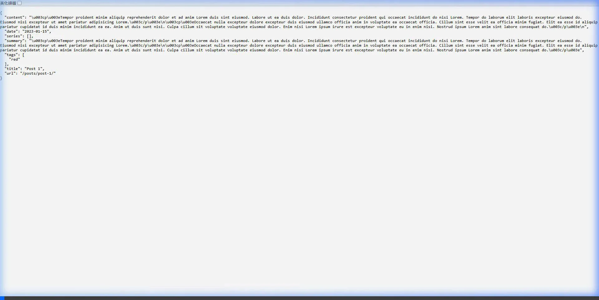
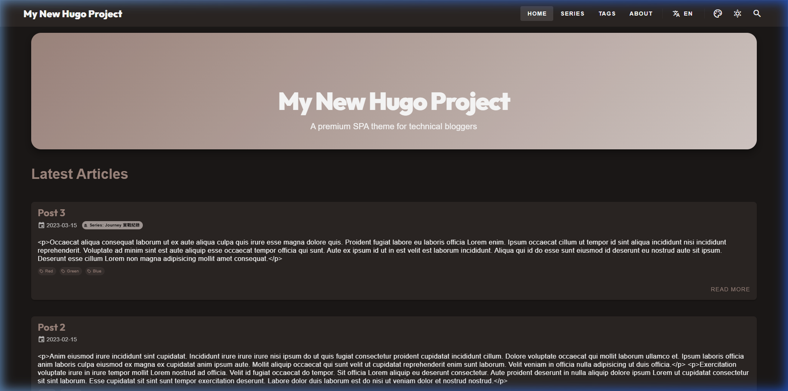

這是一場預謀了五年的實驗。作為《自製主題實踐筆記》系列的開篇，我們從最核心的架構實驗說起。在網頁開發的過程中，有些靈感總是被掛在「以後再說」的清單上。這次在這個佈景主題中，我終於決定硬著頭皮，把這些擱置已久的 SPA 想法做一次徹底的實踐。

<!--more-->

## 1. Headless Hugo 策略：SSG 作為資料源

傳統的 Hugo 用來生成 HTML，但在這次的實驗裡，我讓 Hugo 生成 **JSON 資料**。定義了簡單的 `list.json` 與 `single.json`，讓前端能像讀取靜態檔一樣獲取內容。


*圖：Hugo 將 Markdown 轉為前端 Vue 可讀取的 JSON 格式*

```go
// 範例：layouts/_default/single.json
{
  "title": "{{ .Title }}",
  "content": "{{ .Content | jsonify }}",
  "date": "{{ .Date.Format "2006-01-02" }}",
  "params": {{ .Params | jsonify }}
}
```

這不是什麼大技術，只是讓前端處理起來更直覺一點。

## 2. SPA 路由的「404 重導向小技巧」

在 GitHub Pages 這類靜態平台上實現 SPA，最大的問題是直連 sub-page 會 404。我用了一個很土但管用的方法：
1. 觸發 404 時加載 `404.html`。
2. 迅速把路徑丟進 `sessionStorage` 並跳回家目錄。
3. Vue Router 啟動後再把路徑接回來。

實現了還算過得去的 SPA 跳轉體驗。


*圖：嘗試在 SPA 環境下呈現的簡單設計*

## 3. Disqus 的 SPA 整合

在 SPA 中嵌入 Disqus 常會遇到內容不更新的問題。我寫了一個極簡的 `DisqusComments.js`：
- **`:key="currentRoute"`**：讓 Vue 在換頁時重新掛載組件。
- **懶加載**：只有需要時才叫腳本。

## 【設計反思：被迫對頻的實驗】

> [!TIP]
> **作者筆記 (Vibe Coding 觀察)**：
> 說實話，這套「全手寫 SPA + 404 Hack」的組合技，是在我清單上躺了**五年**都沒動手的「擱置實驗計畫」。以前總覺得寫這套太累，光是想到那些瑣碎的狀態同步就沒動力。
> 
> 這次在 Agent 的推動下，我勉強去適應了那種所謂的 **Vibe Coding**。這對我來說並不是什麼順手的新玩具，而是在各種不適應中與 Agent 「拉鋸」的成果。我得不斷調整自己的說法，去對準 Agent 那套工作邏輯。雖然過程磕磕絆絆，但在這種半推半就的掙扎中，總算是把這五年的擱置點子給清掉了。這種邊整活邊忍受摩擦的感覺，比想像中累，但至少事辦成了。

---

## 4. 結語與下一步

選擇「No-Build Vue」只是為了讓這一切保持簡單，不希望增加使用門檻。這只是一個小小的實踐，希望能提供給同樣想在 Hugo 上整點活的人一點靈感。

基礎的 SPA 骨架搭好後，下一個面臨的問題就是「如何避免程式碼隨著功​​能增加而變成一團亂麻」。在**下一篇（系列之二）**中，我將記錄自己是如何在混亂中，硬拉出一套不妥協的開發規約。
