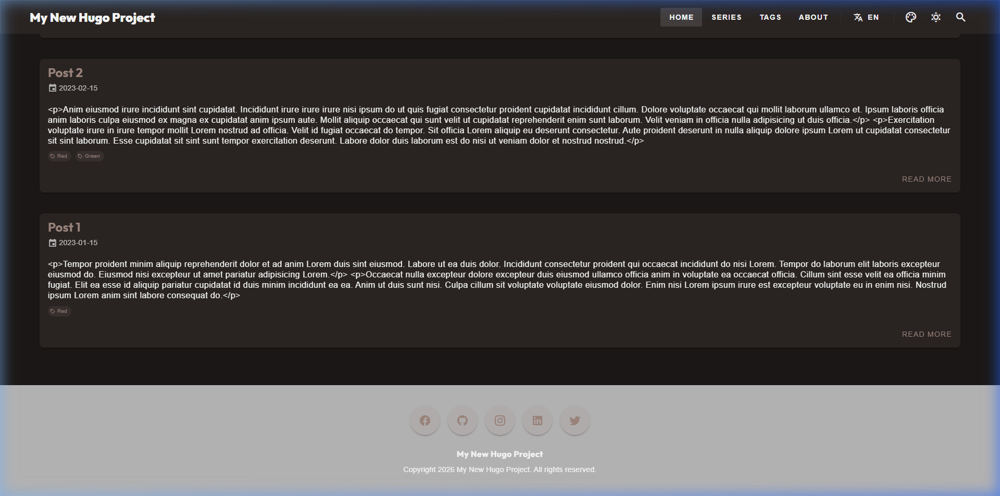

延續**上一篇**我們建立的開發規約，系列之三的重點在於「釋放雙手」。即使是一個個人的「整活」小專案，如果每次更新都要擔心外部 CDN 掛掉或是換行符亂跳，開發起來真的很累。在開發的中後期，我決定把那些瑣碎的維護工作，全部交給機器處理。

<!--more-->

## 1. 簡化版的開發環境

我不喜歡太複雜的文檔。在我們的專案中，我準備了一個 **exampleSite**：
- 所有的功能展示都在 `features-showcase.md`。
- 修改代碼後，點開網站就能看到效果，不用去猜會長怎樣。
- 這不是什麼高深的策略，只是想減少「切換畫面」的焦慮感。

## 2. 小巧的稽核腳本

我寫了個簡單的 **Architecture Audit** (Python 實作)。它在 commit 前會幫我瞄一眼：
- **Vendor Check**：確保我沒亂動本地的庫檔。
- **Asset Health**：看看有沒有直接貼了外部連結。

幫我這種容易忘東忘西的人做最後的把關。

## 3. 視覺系統的小微調

雖然我不是設計師，但我還是稍微整理了一下 CSS 變數：
- **Design Tokens**：把常用顏色與字體整理起來。
- **簡單的動畫**：加了點 `hover-lift` 跟 `fade-up`，讓跳轉時不那麼突兀。

*圖：幫圖標自動排好隊，不用每次都手動調位子*

---

## 【實戰筆記：被推著前行的靈感】

> [!TIP]
> **作者筆記 (Vibe Coding 觀察)**：
> 以前總覺得「自動化稽核」是那種大公司才玩得起的奢侈品。這份「想把流程弄順」的小碎念，在記事本裡放了**五年**，始終只是個擱置的實驗性靈感。
> 
> 在這次開發中，我其實並不是帶著什麼輕鬆的心態在玩。相反地，我是在各種不適應中，勉強配合著 Agent 的節奏去實現這些工具。實作過程充滿了與 Agent 的反覆拉扯——要讓它寫出符合我標準的 Python 腳本，我得忍受在那種對話邏輯不對頻的挫折中反覆糾纏。雖然最後這些擱置五年的靈感確實變成了功能，但那種「被技術浪潮推著走」的摩擦感，才是這場實驗最真實的樣子。

---

## 4. 結語與下一步

機器能做的就交給機器吧，雖然這套工具不算強大，但足以讓我這種懶人能更專注在開發與寫作上。

當架構、規範與自動化工具都到位後，這場高強度的極限開發也算打穩了地基。在**下一篇（系列之四）**，我將跳脫純技術視角，為這場充滿摩擦的「人機協作 (Vibe Coding)」過程，進行一次元層面的總結。
