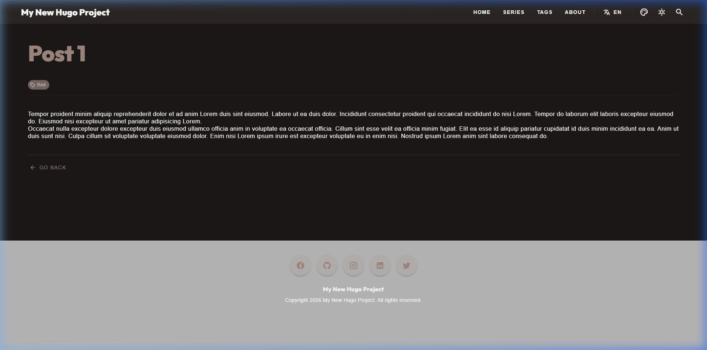
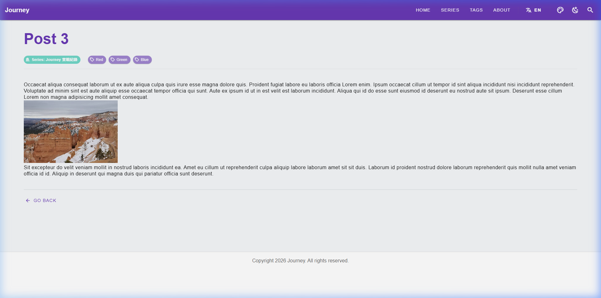

經過前面三篇關於架構、規範與自動化的實踐，這個佈景主題的基底已經成形。在這系列第四篇中，我們不談具體的 code，而是要來聊聊這 24 小時「高強度整活」背後的開發心法。這趟旅程不僅是在寫程式，更是在實驗一種全新的「人機協作」模式：**Vibe Coding**。

<!--more-->

## 1. 讓溝通更有頭緒

與 AI 協作很容易變成漫無目的的亂聊。我試著用一些簡單的文檔來管理狀態：
- **`task.md`**：列出今天想完成的小目標。
- **`implementation_plan.md`**：在寫程式前先確認一下對不對。這是為了確保「整活」的過程中，邏輯不會跑偏。
- **`walkthrough.md`**：幫這場旅程留下一點紀錄。

## 2. 負責「對頻」的人

在這個過程中，我發現最核心的工作不是寫程式，而是定義 **Principles (原則)**。
- 當 AI 想要用複雜的方法時，我會試圖拉回簡單的模式。
- 人類的價值在於知道自己「想要什麼樣的 vibe」，剩下的就讓它去填補細節。這中間充滿了在不適應中與 AI 「對準頻率」的摩擦。

## 3. 效率的提升

原本以為要在一個 SPA 主題中整合 Lightbox、i18n 跟 Disqus 會很麻煩，但透過協作，這些擱置已久的靈感在一天內就搞定了。

*圖：AI 協助下完成的渲染結果，感覺還算體面*

*圖：稍微確認一下貼文細節，確保沒有漏掉什麼*

## 【後記：被迫轉型的隨想】

> [!TIP]
> **作者筆記 (Vibe Coding 觀察)**：
> 很多人會說內容，這不就是叫 AI 幫你寫程式嗎？但我必須強調，這對我來說是一場極度不適應的轉型。這 24 小時最累的一點，就是得在各種「頻率不對」的狀態下，勉強與 Agent 去磨合那所謂的 **Vibe Coding**。我得像個翻譯官一樣，努力不讓我那躺了**五年**的藍圖被 Agent 的預設邏輯給磨平，這中間充滿了來回對抗的掙扎。
> 
> 以前是卡在代碼寫不出來；現在是卡在「該怎麼跟這個新形態的工具共處」。這種從「親手搬磚」被迫變成「冷靜對頻的人」的轉變，其實充滿了心理上的摩擦。但就是在這種不得不去適應的掙扎中，我才真的把這份五年靈感給具現化了。這場革命，其實遠比它看起來的要充滿摩擦且累人。

---

## 4. 結語：在掙扎中守住底線的 SDD

雖然這場開發在 Agent 的引導下呈現出一種 Vibe Coding 的快節奏，但對我來說，能支撐我撐過這場摩擦的關鍵，在於我勉強守住了 **SDD (Spec-Driven Development)** 的底線。

這份專案的背後是我在不適應中硬是拉出的「規約」：
1. **計畫拉鋸 (Spec-Clash)**：所有 Phase 在動手前，我都得反覆跟評估與修正計畫。
2. **被迫同步 (Forced Documentation)**：堅持代碼變動與 `GUIDE.md` 同步，即便 Agent 有時想偷懶。
3. **機器監控 (Audit Logic)**：寫腳本來監控那些我怕被 AI 搞砸的小細節。

正是因為有了 SDD 這個讓我感到踏實的「規約框架」，我才能在那種勉為其難、充滿摩擦的開發節奏中，把那些擱置五年的靈感碎片，強行拼接成現在這個模樣。這不是我的主場，但這是我在那種不適應中，努力交出的答卷。

到這裡，架構與方法論算是總結完了。但真正的實戰開發，哪有不踩坑的？在**本系列的最終篇（系列之五）**中，我將回歸最硬核的技術細節，盤點這趟旅程裡撞上的那些隱蔽陷阱。
